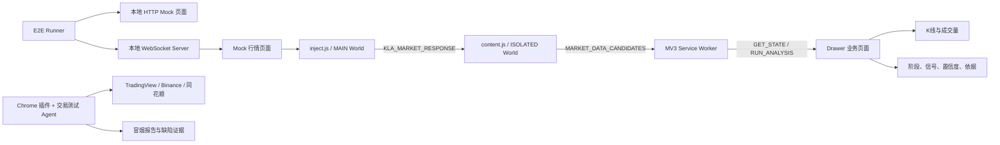
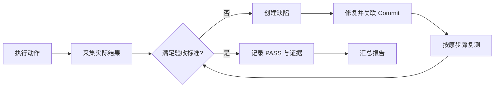

# Chrome K线分析器 E2E 测试与 Agent 真实站点冒烟方案

## 1. 文档信息

| 项目         | 内容                                                |
| ------------ | --------------------------------------------------- |
| 文档类型     | 企业评审版测试方案                                  |
| 适用项目     | Chrome K Line Analyzer，Manifest V3 纯前端扩展      |
| 适用读者     | 前端开发、测试、架构、交易策略评审、发布负责人      |
| 测试目标     | 建立“动作 → 结果 → 证据 → 报告 → 缺陷 → 复测”的闭环 |
| 自动化范围   | 3 条确定性 E2E                                      |
| 真实环境范围 | Agent 执行 TradingView、Binance、同花顺冒烟测试     |
| 非目标       | 不使用 E2E 证明维科夫策略盈利能力，不执行真实交易   |

## 2. 背景与结论

本项目包含以下跨上下文运行链路：

```text
行情网站 WebSocket
  → inject.js（MAIN World）
  → window.postMessage
  → content.js（ISOLATED World）
  → chrome.runtime.sendMessage
  → MV3 Service Worker
  → Drawer / Side Panel
  → K线、成交量和维科夫分析结果
```

单元测试只能证明协议解析函数和策略函数在独立输入下工作，不能证明 Chrome 的 MAIN World、ISOLATED World、Service Worker、Tab 上下文和 Drawer 已正确连通。

本项目采用两层测试体系：

1. **确定性 E2E**：使用本地 Mock 页面和真实 WebSocket 连接，稳定覆盖完整扩展链路，作为代码回归门禁。
2. **Agent 真实站点冒烟**：在真实 TradingView、Binance 和同花顺页面验证当前协议兼容性、Side Panel 行为和行情一致性，输出可人工复核的报告。

两者不得互相替代：确定性 E2E 判断“实现是否按设计工作”，真实站点冒烟判断“当前网站是否仍与实现兼容”。

## 3. 测试架构



本地 HTTP/WebSocket 服务仅属于测试设施，不进入生产插件包，不改变产品“纯前端扩展”的架构属性。

## 4. 测试分层与执行策略

| 层级 | 测试内容                                 | 执行方式                         | 是否阻断               |
| ---- | ---------------------------------------- | -------------------------------- | ---------------------- |
| L1   | WebSocket 协议、OHLCV 标准化、策略纯函数 | Vitest                           | 是                     |
| L2   | 3 条确定性扩展 E2E                       | 持久化 Chromium + 本地 Mock 服务 | 是                     |
| L3   | 三个支持站点真实冒烟                     | Agent 控制真实 Chrome            | PR 否，发布前 P0/P1 是 |
| L4   | Side Panel 原生容器和人工观感            | Agent + 人工复核                 | 发布前是               |

## 5. 测试数据与夹具

### 5.1 夹具清单

| 夹具                 | 内容                                         | 最低要求                          |
| -------------------- | -------------------------------------------- | --------------------------------- |
| TradingView 历史批次 | `timescale_update`、心跳、批量 OHLCV         | 至少 90 根连续 K 线               |
| TradingView 增量帧   | 相同时间戳更新、新时间戳追加                 | 能验证覆盖和追加                  |
| 策略场景             | 放量突破、数据不足、成交量缺失               | 期望阶段、信号和 reason code 固定 |
| 异常帧               | 非法 JSON、截断帧、心跳、非法 OHLC、负成交量 | 不得造成未捕获异常                |
| Mock 页面            | 在 `<head>` 中立即建立 WebSocket             | 验证 `document_start` 注入时机    |
| 多 Tab 数据          | 不同 symbol、period 和价格区间               | 可识别是否串 Tab                  |

### 5.2 数据安全

- 只提交脱敏、最小化、可解释的 fixture。
- 禁止保存 Cookie、Token、账号、设备标识和完整用户会话。
- 真实站点日志只记录 adapter、symbol、period、K线数量、首尾时间和 traceId。
- 截图必须遮盖账号、资产和个人信息。
- 不允许把真实用户 WebSocket 全量帧直接提交到 Git。

## 6. 通用闭环模型

每条 E2E 和每个 Agent 冒烟步骤必须具备以下字段：

| 环节     | 必填内容                                                        |
| -------- | --------------------------------------------------------------- |
| 前置条件 | Commit、插件版本、Chrome 版本、页面、symbol、period、fixture ID |
| 动作     | 可复现的操作和输入，不使用“正常操作”等模糊描述                  |
| 预期结果 | 可量化或可精确观察的判定标准                                    |
| 实际结果 | 真实数量、字段值、耗时和错误信息                                |
| 证据     | 截图、DOM、Canvas 像素、Worker 状态、Console、trace             |
| 判定     | `PASS`、`FAIL` 或 `BLOCKED`                                     |
| 缺陷     | 严重度、复现步骤、初步归属和证据路径                            |
| 复测     | 修复 Commit、复测环境、原失败步骤和最终结论                     |



## 7. E2E-01 WebSocket 完整链路

### 7.1 测试目标

证明 WebSocket 帧能够真实经过：

```text
MAIN World → ISOLATED Content Script → Service Worker
```

不得通过直接调用解析函数或伪造 `window.postMessage` 绕过 WebSocket Hook。

### 7.2 动作、结果与证据

| 步骤 | 动作                          | 预期结果                           | 必留证据                  |
| ---- | ----------------------------- | ---------------------------------- | ------------------------- |
| 1    | 构建并加载 `dist`             | 无 Manifest 和脚本加载错误         | 构建日志、扩展 ID、Commit |
| 2    | 启动本地 HTTP/WS 服务         | 端口就绪，无外网依赖               | Server 启动日志           |
| 3    | 打开 Mock 页面                | 页面在 `<head>` 创建真实 WebSocket | 页面时间线、连接日志      |
| 4    | 发送 TradingView 心跳         | 不生成候选，不抛异常               | Worker 状态、Console      |
| 5    | 发送历史 `timescale_update`   | Worker 对应 Tab 出现一个候选       | `GET_STATE` JSON          |
| 6    | 发送相同时间戳更新            | K线数量不增加，OHLCV 被覆盖        | 更新前后摘要              |
| 7    | 发送新时间戳                  | K线数量增加 1                      | 更新前后数量              |
| 8    | 发送重复、乱序、非法帧        | 合法数据排序去重，非法数据忽略     | 输入/输出摘要、Console    |
| 9    | 打开第二个 Tab 并发送不同数据 | 两个 Tab 状态严格隔离              | 两个 `GET_STATE` JSON     |

### 7.3 数据断言

| 检查项    | 验收标准                                                |
| --------- | ------------------------------------------------------- |
| Hook 时机 | 不晚于页面首次 `new WebSocket()`                        |
| 原生行为  | WebSocket 可连接、收消息和关闭，页面行为未被 Hook 破坏  |
| OHLC      | `high >= max(open, close)` 且 `low <= min(open, close)` |
| 时间戳    | 有限正数，内部统一为毫秒                                |
| 排序      | 标准化后严格按时间递增                                  |
| 去重      | 同一频道、同一时间戳只保留一根                          |
| 实时覆盖  | 同时间戳更新不增加数量                                  |
| 新 K 线   | 新时间戳增加一根                                        |
| 成交量    | 有限且 `>= 0`                                           |
| 最大缓存  | 不超过 2000 根，并淘汰时间最早的数据                    |
| Tab 隔离  | A Tab 数据不得出现在 B Tab                              |
| 异常帧    | 不产生候选，不出现未捕获异常                            |
| 数据身份  | `siteId`、`symbol`、`period` 与 fixture 一致            |

### 7.4 可发现的问题

- MAIN World 注入晚于网站首次 WebSocket 建连。
- `inject.js` 再次被错误构建为 ESM。
- WebSocket Proxy 改变构造器、事件或 URL 行为。
- TradingView 长度前缀解析偏移或心跳误识别。
- MAIN 与 ISOLATED World 的 `postMessage` 桥接失效。
- Content Script 未注入或导航后失效。
- Worker 将行情保存到错误 Tab。
- 相同 K 线被重复追加。
- 乱序数据导致错误淘汰较新的 K 线。
- 宿主页面伪造固定频道消息后被插件接受。

## 8. E2E-02 Drawer 展示与分析

### 8.1 测试目标

证明已捕获的数据可以从 Worker 进入 Drawer，并正确展示 K 线、成交量和可解释分析结果。

### 8.2 动作、结果与证据

| 步骤 | 动作                                       | 预期结果                       | 必留证据        |
| ---- | ------------------------------------------ | ------------------------------ | --------------- |
| 1    | 通过 E2E-01 注入 90 根放量突破 K 线        | Worker 有一个有效候选          | Session JSON    |
| 2    | 打开 `chrome-extension://<id>/drawer.html` | 状态显示已捕获候选             | DOM 快照、截图  |
| 3    | 点击“开始分析”                             | busy 状态出现并能恢复          | 操作 trace      |
| 4    | 等待图表渲染                               | 显示“K线与成交量”，Canvas 非空 | 截图、像素统计  |
| 5    | 检查策略结果                               | `MARKUP`、`BUY`、`B003`        | DOM、响应摘要   |
| 6    | 注入少于用户配置数量的 K 线                | 抛出含实际数量和所需数量的错误 | 截图、错误文本  |
| 7    | 注入成交量全零数据                         | 强制 `HOLD` 并显示成交量缺失   | 截图、结果 JSON |

### 8.3 图表和业务断言

- K 线序列数量与标准化数据数量一致。
- 成交量序列数量与 K 线数量一致。
- 阳线、阴线颜色与 `close >= open` 一致。
- Canvas 不得为空白或只有背景色。
- 页面不得出现 `NaN`、`Infinity`、乱码和未捕获异常。
- 最新价格等于 `signal.price`。
- 支撑位为分析窗口最低 `low`，阻力位为最高 `high`。
- `volumeSummary.ratio = latest / average`，允许误差 `1e-6`。
- 放量突破 fixture 必须得到 `MARKUP / BUY / B003`。
- 少于用户配置数量、低于系统下限 20 根或成交量缺失时不得生成正式分析结果。
- symbol 或 period 无法确认时，报告必须标记“数据身份未确认”；正式产品应降级为 `HOLD/UNKNOWN`，该行为需后续实现。
- 未收盘 K 线只能产生预览结果；在模型支持 `closed` 字段前，应在报告中标记风险。

### 8.4 可发现的问题

- Drawer 查询了错误的活动 Tab。
- Worker 有候选但 Drawer 未刷新。
- `RUN_ANALYSIS` 失败后 busy 状态不恢复。
- OHLCV 标准化丢失数据。
- Lightweight Charts 尺寸错误、Canvas 空白或成交量未绘制。
- 策略输出与输入 fixture 不一致。
- 数据不足仍输出买卖信号。
- UI 文案乱码、溢出或错误不可见。

## 9. E2E-03 框选启动、完成与取消

### 9.1 场景 A：启动并完成

| 动作                         | 预期结果                           | 证据                  |
| ---------------------------- | ---------------------------------- | --------------------- |
| 点击“框选 K 线”              | 500ms 内出现一个全屏遮罩和十字光标 | 页面截图、DOM 样式    |
| 从右下向左上拖拽大于 `40×40` | 矩形实时显示，宽高始终为正         | 拖拽截图、坐标        |
| 松开鼠标                     | 遮罩移除，发送 `SELECTION_DONE`    | 消息日志              |
| 查询 Worker 状态             | `rect`、viewport、URL、时间戳正确  | `GET_STATE.selection` |

### 9.2 场景 B：Esc 取消

| 动作             | 预期结果                               | 证据       |
| ---------------- | -------------------------------------- | ---------- |
| 再次启动框选     | 只存在一个遮罩                         | DOM 数量   |
| 按 `Escape`      | 遮罩立即移除                           | 前后截图   |
| 查询 Worker 状态 | 不产生新 selection，不覆盖原有有效选择 | 状态 JSON  |
| 操作页面         | 页面恢复正常点击和滚动                 | 操作 trace |

### 9.3 边界断言

- 小于 `40×40` 的拖拽不产生 selection。
- 反向拖拽坐标必须归一化。
- 重复点击最多产生一个遮罩，不积累事件监听器。
- 页面滚动时记录正确的 viewport 与 `scrollX/scrollY`。
- 插件重载后旧页面缺少 Content Script 时，Drawer 必须显示明确错误，不得静默失败。
- 页面刷新、Tab 切换后，选择结果必须写入正确 Tab。

### 9.4 可发现的问题

- `tabs.sendMessage` 无接收者时被静默吞掉。
- 重复点击产生多个遮罩。
- Esc 监听器残留或 `finish()` 重复执行。
- 小区域错误生成 selection。
- 坐标计算错误或写入错误 Tab。
- 插件重载后旧页面无法恢复。

## 10. Agent 真实站点冒烟

### 10.0 已实现的 Binance 与同花顺自动化门禁

执行命令：`npm run test:e2e:binance`、`npm run test:e2e:tonghuashun`；发布时统一运行 `npm run test:e2e:release`，单站点双语验收运行 `npm run test:e2e:locale`，双站点双语商店素材验收运行 `npm run test:e2e:assets`。

固定页面：

- Binance：`https://www.binance.com/en/trade/BTC_USDT?type=spot`；
- 同花顺：`https://stockpage.10jqka.com.cn/600519/`。

当前自动化会加载最新 `dist`，并验证：

1. 从真实 popup 用户手势调用 `chrome.sidePanel.open`，并通过 CDP 确认 Drawer 是原生 Side Panel target，不是普通扩展 Tab；
2. 制造同一行情页面的无害查询参数差异，验证不会误报“旧页面数据”，同时不同标的仍严格隔离；
3. 点击“开始分析”后必须展示策略结论、阶段、置信度和至少一条分析依据；
4. 展示最近 200 根 K 线，消息请求/响应 Tab ID 必须等于当前行情 Tab，后台返回和 DOM 均为 200 根，Canvas 像素必须包含多种实际绘制颜色；
5. 将分析 K 线数量改为 64 后自动重算，请求参数、响应数据、说明文字和图表数据属性同步变为 64；
6. 点击右上角“重置分析台”后，结果和图表被清空，策略参数恢复默认 200；
7. 检查 Popup 固定宽度以及 Side Panel 放宽、缩窄、极窄折叠和恢复后的布局；
8. 两个站点分别保存行情页、200 根、64 根、响应式和重置后的真实 Side Panel 截图，失败时保存对应站点的 `e2e-failure.png`。
9. 分别以 `en-US` 和 `zh-CN` 启动 Chrome，校验 `chrome.i18n.getUILanguage()`、Popup、Side Panel 和分析结果的语言一致。
10. 断言界面不直接暴露 `BUY`、`MARKUP`等内部状态枚举，但后台响应仍保留这些稳定机器值。

发布打包命令 `npm run package` 必须先通过 Binance 英文和同花顺简体中文的真实站点 E2E，避免仅凭单元测试发布。商店截图生成会进一步运行两个站点的中英文组合。

### 10.1 Agent 角色

Agent 同时执行两类职责：

- **Chrome 插件测试职责**：加载扩展、检查 MV3 上下文、Side Panel、Console、截图和消息链路。
- **交易行情测试职责**：核对 symbol、period、OHLCV、末根价格、成交量、数据数量和信号降级条件。

Agent 不得判断某个 `BUY/SELL` 是否会盈利，只判断数据身份、计算一致性和风险提示是否符合设计。

### 10.2 TradingView 动作闭环

| ID    | Agent 动作                          | 预期结果                      | 证据                  | 失败归类       |
| ----- | ----------------------------------- | ----------------------------- | --------------------- | -------------- |
| TV-01 | 记录 Commit、插件和 Chrome 版本     | 环境可追溯                    | 版本截图和文本        | 环境           |
| TV-02 | 从最新 `dist` 加载扩展              | 无 Manifest、SW、Content 错误 | 扩展页截图            | 构建/Manifest  |
| TV-03 | 打开固定 NVDA 1D 页面并刷新         | 页面显示蜡烛和成交量          | 全页截图              | 外站/页面      |
| TV-04 | 打开 Side Panel                     | 显示量价分析台                | Side Panel 截图       | Side Panel     |
| TV-05 | 等待 WebSocket 捕获                 | 候选数从 0 变为至少 1         | 状态截图、Worker 摘要 | 注入/协议/桥接 |
| TV-06 | 核对 symbol、period、末根价格和时间 | 插件与页面当前图表一致        | 对比表和截图          | 数据身份       |
| TV-07 | 点击开始分析                        | 显示“K线与成交量”和分析结果   | Drawer 全页截图       | 标准化/策略/UI |
| TV-08 | 切换到 1H 并重新捕获                | 数据身份和时间间隔更新        | 前后截图和摘要        | 协议/状态污染  |
| TV-09 | 切换另一个 symbol                   | 不混入 NVDA 旧数据            | 前后 Session 摘要     | 会话隔离       |
| TV-10 | 完成一次框选并 Esc 取消一次         | 两种交互均符合预期            | 操作前后截图          | 框选           |
| TV-11 | 检查页面、Worker、扩展 Console      | 无未解释异常                  | Console 截图/文本     | 对应上下文     |

TradingView 至少覆盖两个 symbol、两个 period；Binance 和同花顺分别至少覆盖一个可识别标的，并验证日、周、月周期映射。

## 11. 必须报告为缺陷的现象

- 页面 symbol 与插件分析 symbol 不一致。
- 页面切换 period 后插件仍使用旧数据。
- 时间戳重复、倒序或整体周期错误。
- `high < open/close`、`low > open/close`。
- 成交量为负、`NaN` 或无穷大。
- 同一未收盘 K 线被重复追加。
- 当前 K 线更新修改了其他已收盘历史 K 线。
- 少于用户配置数量、低于系统下限 20 根或成交量缺失仍输出正式 `BUY/SELL`。
- 两个 Tab 或两个 symbol 数据混合。
- Worker 已有候选但 Drawer 一直显示等待。
- 图表空白、K线和成交量数量不一致。
- 点击框选没有响应且没有错误提示。
- 页面、Worker 或扩展 Console 出现未捕获异常。
- 插件导致宿主 WebSocket 断连或网站功能异常。
- 宿主页面伪造固定 `postMessage` 后被插件接受。
- 中文文案显示乱码。

以下现象可属于正常市场行为，但报告必须注明上下文：

- 休市期间没有新 K 线。
- 未收盘 K 线 OHLCV 持续变化。
- 股票隔夜、周末、停牌产生时间缺口。
- TradingView 与交易所因数据源、复权或时区出现差异。
- 不同平台使用基础资产成交量或计价资产成交额，绝对值不可直接比较。

## 12. 缺陷分级与流转

| 级别 | 标准                                                                     | 发布处理       |
| ---- | ------------------------------------------------------------------------ | -------------- |
| P0   | 插件无法加载、行情完全无法捕获、宿主页面被破坏、数据身份错误仍给买卖结论 | 禁止合并和发布 |
| P1   | 主链路偶发失败、Tab 串数据、错误信号未降级、框选不可用且无提示           | 禁止发布       |
| P2   | 个别异常帧诊断不足、文案或布局问题、有可用绕行方案                       | 可评估延期     |
| P3   | 不影响功能的体验或日志优化                                               | 纳入后续迭代   |

缺陷必须包含：

```text
标题
严重度
环境与 Commit
前置条件
最短复现步骤
预期结果
实际结果
截图/Console/trace/状态快照
初步归属：注入/协议/桥接/Worker/标准化/策略/Drawer/框选/环境
修复 Commit
复测结论
```

## 13. Agent 冒烟报告模板

```markdown
# Chrome K线分析器真实站点冒烟报告

- 报告 ID：
- 执行时间：
- 执行 Agent：
- Git Commit：
- 插件版本：
- dist 构建哈希：
- Chrome / 操作系统：
- 总结论：PASS / FAIL / BLOCKED

## 测试对象

| 网站 | URL | 登录状态 | Symbol | Period | 市场状态 |

## 动作与结果

| ID | 动作 | 预期 | 实际值 | 证据 | 判定 |

## 行情一致性

| 项目 | 网站显示 | 插件数据 | 差异 | 判定 |
| Symbol | | | | |
| Period | | | | |
| 末根时间 | | | | |
| Open | | | | |
| High | | | | |
| Low | | | | |
| Close | | | | |
| Volume | | | | |

## Drawer 与框选

| 检查项 | 实际结果 | 证据 | 判定 |

## Console 与诊断

| 上下文 | 错误/警告 | 首次出现步骤 | 证据 |

## 问题清单

| Bug ID | 严重度 | 问题 | 复现步骤 | 证据 | 初步归属 |

## 安全检查

- 截图已遮盖账户和资产信息：是/否
- 未保存 Cookie/Token：是/否
- 未提交真实完整行情帧：是/否

## 限制与人工复核

- 环境限制：
- 阻塞原因：
- 需要人工确认：
```

## 14. 自动化报告要求

每次确定性 E2E 输出：

```text
artifacts/e2e/<run-id>/
  summary.json
  junit.xml
  trace.zip
  screenshots/
  page-console.log
  worker-console.log
  mock-server.log
  session-snapshot.json
```

`summary.json` 至少包含：Commit、扩展版本、浏览器版本、fixture ID、执行耗时、输入 K线数量、输出 K线数量、候选数量、最终阶段、最终信号和失败分类。

## 15. Side Panel 与 MV3 边界

### 15.1 Side Panel

- Binance 发布门禁通过 popup 用户手势打开原生 Side Panel，并直接连接该 Side Panel target 完成业务断言。
- E2E 必须拒绝把 `drawer.html` 作为普通浏览器 Tab 打开，防止绕过 Side Panel 的 Tab 关联和消息发送者边界。
- 原生面板固定、关闭、切换 Tab 和左右位置不做跨平台像素门禁。
- Agent 必须保留原生 Side Panel 与主行情图同屏截图。

### 15.2 Service Worker

当前 Service Worker 使用内存 `Map` 保存 Session。Worker 被 Chrome 回收后，候选和框选状态可能丢失。

本期验收边界：三条 E2E 在同一活跃 Worker 生命周期内执行并记录该风险。后续改用 `chrome.storage.session` 后，应增加 Worker 终止和恢复测试。不得通过定时心跳长期保持 Worker 存活来掩盖状态设计问题。

### 15.3 MAIN World 安全边界

固定 `KLA_MARKET_RESPONSE` 频道可被宿主页面伪造。后续安全加固应增加：

- 消息 schema 校验；
- K线数量、字段、帧长度限制；
- 每页随机 nonce；
- 异常消息计数与限流；
- 日志脱敏。

安全 E2E 应验证伪造、超大和非法消息不会进入 Worker 候选。

## 16. 准入标准

### 16.1 PR 准入

- Vitest 全部通过。
- 3 条确定性 E2E 全部通过。
- 每条 E2E 连续运行 10 次无随机失败。
- 测试不依赖公网，不共享浏览器用户数据。
- 页面、Content、Worker、Drawer Console 无未解释异常。
- 失败时能够生成完整诊断产物。

### 16.2 发布准入

- PR 准入全部满足。
- TradingView 至少两个 symbol、两个 period 通过，Binance 和同花顺各至少一个目标页面通过。
- Side Panel 原生打开和同屏交互通过。
- 无未关闭的 P0/P1。
- 所有 `FAIL/BLOCKED` 都有证据和责任归属。
- 数据身份无法确认、数据不足或未收盘时，不得输出正式买卖结论。

## 17. 实施顺序

1. 固定测试依赖版本，建立持久化 Chromium fixture。
2. 建立本地 HTTP/WebSocket 测试服务和脱敏 fixture。
3. 实现 E2E-01，并打通 Worker 状态读取与诊断。
4. 为 Drawer 增加稳定的 `data-testid` 和 Canvas 可观测点，实现 E2E-02。
5. 为框选遮罩增加稳定标识和错误可见性，实现 E2E-03。
6. 建立统一 artifacts、JUnit 和缺陷模板。
7. 编写 Agent 三个支持站点的冒烟操作规程。
8. 连续执行 10 次，修复随机失败后接入 PR 门禁。

## 18. 当前已知前置缺口

在实施测试时预计会暴露并需要处理：

1. Drawer 对 `tabs.sendMessage` 失败没有用户可见错误。
2. 框选重复启动可能产生多个遮罩或残留监听器。
3. TradingView 适配器尚未可靠提取 symbol 和 period。
4. 缓存淘汰依赖 Map 插入顺序，乱序帧可能淘汰错误 K 线。
5. Service Worker 内存状态无法跨 Worker 生命周期恢复。
6. MAIN → Content 固定频道缺少 schema、nonce 和输入上限。

这些缺口不是删除测试场景的理由；测试应先准确暴露问题，再由缺陷流转决定修复优先级。

## 19. 评审结论

Chrome 扩展测试专家和交易行情测试专家一致建议：采用“3 条确定性 E2E + Agent 真实站点冒烟”的组合方案。

核心原则：

- 不以真实网站代替可重复测试。
- 不以 Mock 测试代替真实协议兼容验证。
- 不以“页面看起来正常”作为通过依据。
- 不把策略实现一致性误称为策略盈利有效性。
- 每个失败必须产生可复现证据并进入修复、复测闭环。
