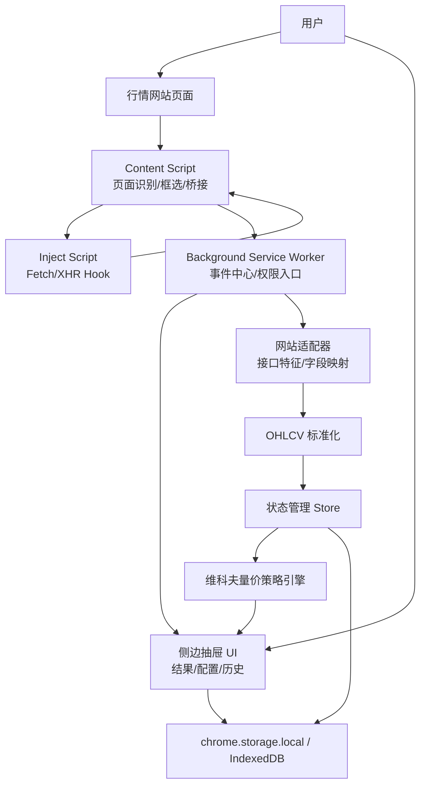
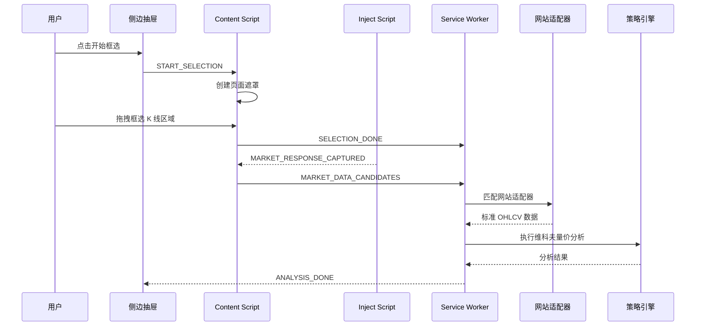

# Chrome K 线分析器插件总体技术与架构方案

## 1. 文档说明

### 1.1 文档目标

本文档定义 Chrome 浏览器环境下纯前端 K 线分析器插件的总体技术方案和架构方案，用于统一业务目标、功能边界、架构分层、技术选型、部署方式、安全要求、风险和落地排期。

### 1.2 适用读者

| 角色       | 关注点                                                     |
| ---------- | ---------------------------------------------------------- |
| 业务负责人 | K 线框选、行情采集、维科夫策略分析和买卖点输出是否满足需求 |
| 技术负责人 | 架构是否可落地、风险是否可控、是否满足纯前端约束           |
| 前端负责人 | 技术栈、模块边界、开发复杂度、可维护性                     |
| 测试负责人 | 验收边界、兼容性、性能和风险场景                           |
| 发布负责人 | Chrome 插件发布、灰度、回滚和权限审核                      |

### 1.3 方案范围

项目开发一个 Chrome 插件，运行于用户浏览器中。插件通过 Content Script、Inject Script、Background Service Worker 和侧边抽屉面板协作，实现行情网站 K 线区域框选、行情接口识别、OHLCV 数据标准化、维科夫量价策略分析、买点卖点展示、历史记录与配置管理。

### 1.4 不做事项

| 项目                   | 说明                                                   |
| ---------------------- | ------------------------------------------------------ |
| 不建设后端服务         | 当前版本纯前端，所有计算和缓存均在浏览器本地完成       |
| 不抓取用户账号信息     | 不读取 Cookie、Token、手机号、邮箱、交易账户等敏感信息 |
| 不承诺交易收益         | 输出技术分析参考，不构成投资建议                       |
| 不绕过目标网站安全策略 | 仅在用户主动访问网页时识别页面内可见和可请求的数据     |
| 不支持自动下单         | 不接入券商、交易所或任何交易执行接口                   |

## 2. 背景与目标

### 2.1 业务背景

用户在行情网站浏览 K 线时，需要快速判断当前走势是否处于吸筹、洗盘、拉升、派发或下跌阶段。传统方式依赖人工观察，存在效率低、记录难、判断口径不稳定的问题。本插件通过侧边抽屉叠加在行情页面上，帮助用户在框选指定 K 线区域后快速得到基于量价规则的分析结果。

### 2.2 建设目标

| 目标                 | 可验收结果                                              |
| -------------------- | ------------------------------------------------------- |
| 支持 Chrome 插件运行 | 可在 Chrome 开发者模式加载，后续可提交 Chrome Web Store |
| 支持 K 线区域框选    | 用户可在行情页面上拖拽框选 K 线区间                     |
| 支持行情接口识别     | 能识别目标行情站点页面内 Fetch/XHR 行情接口             |
| 支持 OHLCV 标准化    | 将不同网站数据统一为 Candle 数据模型                    |
| 支持维科夫分析       | 输出阶段判断、买点、卖点、观望和风险提示                |
| 支持侧边抽屉 UI      | 用户可查看图表、信号、解释、参数和历史                  |
| 支持本地缓存         | 配置和历史记录保存在浏览器本地                          |
| 支持开发调试         | 提供上手、调试、构建、测试和发布文档                    |

## 3. 需求分析

### 3.1 功能需求

| 编号 | 功能     | 描述                               | 优先级 |
| ---- | -------- | ---------------------------------- | ------ |
| F001 | 插件加载 | 支持 Manifest V3 插件加载和运行    | P0     |
| F002 | 页面识别 | 识别当前页面是否为支持的行情网站   | P0     |
| F003 | K 线框选 | 在页面上拖拽选择分析区域           | P0     |
| F004 | 接口嗅探 | 监听页面内行情 Fetch/XHR 请求      | P0     |
| F005 | 数据解析 | 将原始数据转为 OHLCV               | P0     |
| F006 | 策略分析 | 基于维科夫量价规则输出信号         | P0     |
| F007 | 结果展示 | 侧边抽屉展示信号、解释和风险       | P0     |
| F008 | 参数配置 | 支持成交量均线、窗口长度、阈值配置 | P1     |
| F009 | 历史记录 | 保存最近分析记录                   | P1     |
| F010 | 导出复制 | 支持复制 Markdown 或 JSON 分析结果 | P2     |

### 3.2 非功能需求

| 类型     | 指标                                               |
| -------- | -------------------------------------------------- |
| 性能     | 插件注入不影响页面首屏；1000 根 K 线分析低于 300ms |
| 稳定性   | 单页面采集失败不影响浏览器正常访问                 |
| 安全     | 权限最小化，不收集敏感身份信息                     |
| 兼容性   | 优先支持 Chrome 最新稳定版和 Chromium 内核浏览器   |
| 可维护性 | 通过网站适配器隔离不同行情网站差异                 |
| 可测试性 | 策略引擎、数据解析、消息通信、UI 状态均可单测      |

## 4. 总体架构

### 4.1 架构说明

插件采用纯前端架构，核心由四类运行环境组成：

1. `Content Script`：运行在网页隔离环境，负责页面识别、框选遮罩、DOM 读取和桥接。
2. `Inject Script`：注入页面主世界，负责 Hook 页面 Fetch/XHR，捕获行情接口响应摘要。
3. `Background Service Worker`：插件后台事件中心，负责消息转发、权限受控操作、数据协调和缓存入口。
4. `Drawer UI`：侧边抽屉面板，负责交互、配置、结果展示和历史记录。

### 4.2 总体架构图



### 4.3 核心业务链路



## 5. 技术选型

### 5.1 选型总览

| 领域     | 推荐方案            | 优势                  | 劣势                      | 取舍原因                   |
| -------- | ------------------- | --------------------- | ------------------------- | -------------------------- |
| 插件规范 | Manifest V3         | Chrome 主推、长期维护 | Service Worker 生命周期短 | 发布审核和长期兼容优先     |
| 前端框架 | React + TypeScript  | 生态成熟、组件化强    | 需要构建配置              | 适合复杂抽屉 UI 和状态拆分 |
| 构建工具 | Vite                | 快、多入口配置轻      | 插件场景需额外配置        | 开发效率高，产物简单       |
| 状态管理 | Zustand             | 简洁、样板少          | 约束弱                    | 适合本项目中等复杂状态     |
| 图表     | Lightweight Charts  | 金融图表轻量          | 定制能力不如自研          | K 线展示成本低、性能好     |
| 存储     | storage + IndexedDB | 小配置和大历史分层    | 两套 API                  | 性能和容量平衡             |
| 测试     | Vitest + Playwright | 单测和 E2E 覆盖完整   | E2E 配置复杂              | 插件质量门禁需要真实浏览器 |

### 5.2 接口采集选型

| 方案           | 优势               | 劣势               | 使用策略 |
| -------------- | ------------------ | ------------------ | -------- |
| Fetch/XHR Hook | 能拿到页面真实响应 | 需要 Inject Script | 主方案   |
| webRequest     | 可辅助识别 URL     | MV3 响应体受限     | 辅助方案 |
| DOM 提取       | 不依赖接口格式     | 精度低、易变       | 降级方案 |

推荐组合：`Fetch/XHR Hook + webRequest URL 辅助识别 + DOM 降级提取`。

## 6. 模块拆分

| 模块            | 职责                         | 主要输入           | 主要输出         |
| --------------- | ---------------------------- | ------------------ | ---------------- |
| Extension Entry | 插件入口、权限声明、页面注入 | Manifest 配置      | 插件运行上下文   |
| Page Detector   | 判断当前网站是否支持         | URL、DOM 特征      | SiteProfile      |
| Selection Tool  | 页面框选交互                 | 鼠标事件、视口信息 | SelectionRange   |
| Network Capture | 捕获行情接口候选数据         | Fetch/XHR 响应     | RawMarketPayload |
| Site Adapter    | 适配不同行情网站             | RawMarketPayload   | MarketData       |
| Data Normalizer | 统一 OHLCV                   | 多格式行情数据     | Candle[]         |
| Analysis Engine | 维科夫分析                   | Candle[]、配置     | AnalysisResult   |
| Drawer UI       | 结果展示和用户操作           | Store 状态         | 页面视图         |
| Storage         | 本地缓存                     | 配置、历史、日志   | 本地持久化数据   |

## 7. 部署结构

```text
src/
  background/
  content/
  inject/
  drawer/
  popup/
  options/
  core/
    adapter/
    analysis/
    model/
    store/
  shared/
manifest.config.ts
vite.config.ts
```

```text
dist/
  manifest.json
  background.js
  content.js
  inject.js
  drawer.html
  drawer.js
  popup.html
  options.html
  assets/
```

## 8. 安全与合规摘要

| 数据                    | 是否采集 | 处理方式               |
| ----------------------- | -------- | ---------------------- |
| K 线行情数据            | 是       | 本地分析、本地缓存     |
| 用户配置                | 是       | chrome.storage.local   |
| 分析历史                | 是       | 本地保存，可清理       |
| 用户账号、Cookie、Token | 否       | 不读取、不保存、不上传 |
| 交易行为                | 否       | 不接入交易系统         |

插件输出内容仅作为技术分析辅助信息，不构成投资建议，不保证信号准确率，不承诺收益。UI 中必须展示风险提示和免责声明。

## 9. 性能目标

| 指标                  | 目标                     |
| --------------------- | ------------------------ |
| Content Script 初始化 | 低于 50ms                |
| 单次框选响应          | 事件处理节流到 16ms 以上 |
| 1000 根 K 线标准化    | 低于 100ms               |
| 1000 根 K 线策略分析  | 低于 300ms               |
| 抽屉打开时间          | 低于 300ms               |
| 历史记录容量          | 默认保留 100 条，可配置  |

## 10. 风险清单

| 风险编号 | 风险                  | 影响                | 概率 | 应对措施                           |
| -------- | --------------------- | ------------------- | ---- | ---------------------------------- |
| R001     | 行情网站接口变更      | 数据采集失败        | 高   | 网站适配器隔离，接口特征多策略匹配 |
| R002     | Chrome 权限审核不通过 | 发布延期            | 中   | 权限最小化，准备审核说明           |
| R003     | 策略误判              | 用户误用            | 中   | 输出置信度、解释和风险提示         |
| R004     | 页面结构变化          | 框选或 DOM 降级失败 | 高   | 框选与数据采集解耦                 |
| R005     | 大数据量卡顿          | 用户体验下降        | 中   | 分片计算、缓存、Web Worker 预留    |

## 11. 落地排期

| 阶段               | 周期 | 交付物                               |
| ------------------ | ---: | ------------------------------------ |
| 需求确认与技术预研 | 1 周 | 支持站点清单、数据样本、技术验证     |
| 插件基础框架       | 1 周 | Manifest、Vite、React、基础通信      |
| 接口采集与适配器   | 2 周 | Fetch/XHR Hook、适配器、OHLCV 标准化 |
| 策略引擎           | 2 周 | 成交量分析、维科夫阶段、买卖点规则   |
| 侧边抽屉 UI        | 2 周 | 框选、结果、配置、历史               |
| 测试与修复         | 2 周 | 单测、E2E、兼容性、性能测试          |
| 灰度与上线         | 1 周 | 发布包、审核材料、回滚预案           |

## 12. 验收标准

| 验收项     | 标准                                      |
| ---------- | ----------------------------------------- |
| 插件加载   | Chrome 开发者模式加载无错误               |
| 框选能力   | 支持目标行情页面框选并获取 SelectionRange |
| 数据采集   | 支持至少 2 个目标网站行情数据识别         |
| 数据标准化 | OHLCV 字段完整率达到 99%                  |
| 策略输出   | 能输出阶段、信号、置信度和解释            |
| UI 展示    | 侧边抽屉完整展示分析结果和风险提示        |
| 性能       | 1000 根 K 线分析低于 300ms                |

## 13. 任务拆解

```text
T1 初始化 Manifest V3 + Vite + React + TypeScript 工程
T2 实现 Background Service Worker、Content Script、Inject Script 基础通信
T3 实现页面识别和支持站点配置
T4 实现 K 线框选遮罩和 SelectionRange 计算
T5 实现 Fetch/XHR Hook 与候选行情响应收集
T6 实现网站适配器和 OHLCV 标准化
T7 实现 Zustand Store 和本地缓存
T8 实现维科夫策略分析引擎
T9 实现侧边抽屉 UI、配置、历史和导出
T10 补齐单元测试、E2E、性能测试和发布脚本
```
