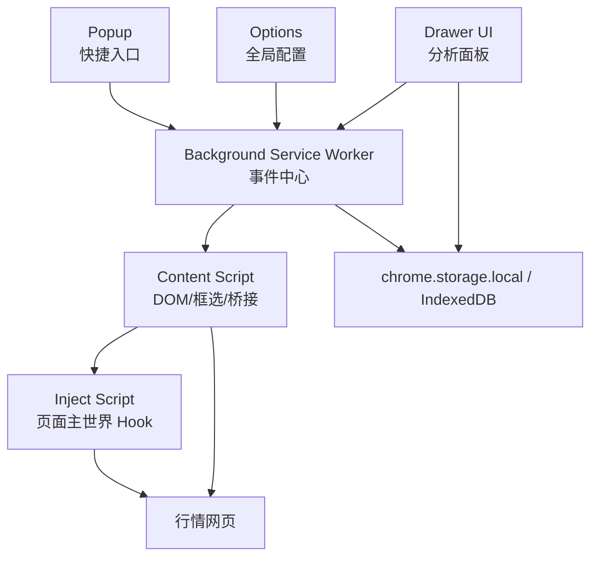
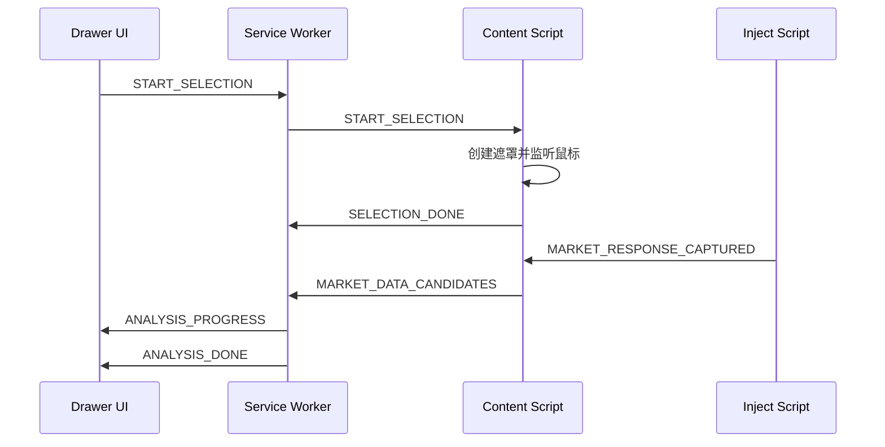

# Chrome Extension Manifest V3、权限与运行时设计方案

## 1. 文档说明

本文档定义 K 线分析器插件的 Manifest V3 配置、权限边界、运行时上下文、Service Worker、Content Script、Inject Script、Drawer UI、Popup、Options 页面以及消息通信协议。

## 2. 设计目标

| 目标 | 说明 |
|---|---|
| 权限最小化 | 只申请实现功能必需的权限 |
| 上下文清晰 | 明确每类脚本运行环境和可访问能力 |
| 通信可控 | 统一消息协议、错误码和追踪 ID |
| 可审核 | Manifest 权限、Host 权限、CSP 可解释 |
| 可扩展 | 支持后续增加站点、策略、配置页面 |

## 3. Manifest V3 方案

```json
{
  "manifest_version": 3,
  "name": "K Line Analyzer",
  "version": "0.1.0",
  "description": "K 线量价分析与维科夫策略辅助工具",
  "action": { "default_popup": "popup.html", "default_title": "K Line Analyzer" },
  "background": { "service_worker": "background.js", "type": "module" },
  "permissions": ["storage", "scripting", "activeTab"],
  "optional_permissions": ["webRequest"],
  "host_permissions": ["https://*.example-market.com/*"],
  "content_scripts": [{ "matches": ["https://*.example-market.com/*"], "js": ["content.js"], "run_at": "document_idle" }],
  "options_page": "options.html",
  "web_accessible_resources": [{ "resources": ["inject.js", "drawer.html", "assets/*"], "matches": ["https://*.example-market.com/*"] }],
  "content_security_policy": { "extension_pages": "script-src 'self'; object-src 'self'" }
}
```

| 字段 | 用途 | 落地建议 |
|---|---|---|
| `manifest_version` | 使用 MV3 | 固定为 3 |
| `background.service_worker` | 后台事件中心 | 使用 ES Module |
| `permissions.storage` | 保存配置与历史 | 必需 |
| `permissions.scripting` | 动态注入 Inject Script | 必需 |
| `permissions.activeTab` | 当前 Tab 受控访问 | 必需 |
| `optional_permissions.webRequest` | 辅助识别接口 URL | 视站点适配情况启用 |
| `host_permissions` | 限定可访问域名 | 按站点白名单配置 |
| `web_accessible_resources` | 暴露 inject.js | 限定 matches |

## 4. 权限设计

| 权限 | 是否必需 | 使用场景 | 风险 | 控制措施 |
|---|---|---|---|---|
| `storage` | 是 | 用户配置、历史记录、调试日志 | 本地数据泄露 | 不存敏感身份信息，提供清理入口 |
| `scripting` | 是 | 注入 Inject Script | 注入范围过大 | 限定 Host Permissions |
| `activeTab` | 是 | 用户主动点击后访问当前页面 | 越权访问页面 | 只在用户交互后触发 |
| `webRequest` | 可选 | 辅助识别接口 URL | 审核敏感 | 作为 optional 权限并说明用途 |
| `sidePanel` | 可选 | 使用 Chrome 原生 Side Panel | 兼容性约束 | 若使用自定义 Drawer 可不申请 |

## 5. 运行上下文设计



| 上下文 | 职责 | 禁止事项 |
|---|---|---|
| Service Worker | 消息路由、权限入口、Tab 状态、缓存协调 | 不保存不可恢复的长期内存状态 |
| Content Script | 页面识别、框选遮罩、Inject 桥接、DOM 降级 | 不执行页面返回的字符串代码 |
| Inject Script | Hook Fetch/XHR，捕获响应摘要 | 不访问 chrome API |
| Drawer UI | 交互、结果、配置、历史 | 不使用危险 HTML 渲染外部文本 |
| Popup | 快捷入口 | 不承载复杂分析流程 |
| Options | 全局配置 | 不处理页面实时状态 |

## 6. 消息通信设计



```typescript
export type ExtensionMessage<T = unknown> = {
  id: string;
  type: ExtensionMessageType;
  source: "popup" | "options" | "drawer" | "background" | "content" | "inject";
  target?: "popup" | "options" | "drawer" | "background" | "content";
  tabId?: number;
  payload?: T;
  traceId: string;
  timestamp: number;
};

export type ExtensionResponse<T = unknown> = {
  id: string;
  traceId: string;
  ok: boolean;
  data?: T;
  error?: ExtensionError;
};
```

| 消息类型 | 发送方 | 接收方 | 触发时机 | Payload |
|---|---|---|---|---|
| `PAGE_DETECTED` | Content | Background | 页面识别完成 | `SiteProfile` |
| `START_SELECTION` | Drawer | Content | 用户点击框选 | 无 |
| `SELECTION_DONE` | Content | Background | 框选完成 | `SelectionRange` |
| `MARKET_RESPONSE_CAPTURED` | Inject | Content | 捕获接口响应 | `CapturedMarketResponse` |
| `MARKET_DATA_CANDIDATES` | Content | Background | 候选数据更新 | `RawMarketPayload[]` |
| `RUN_ANALYSIS` | Drawer | Background | 用户点击分析 | `AnalysisRequest` |
| `ANALYSIS_DONE` | Background | Drawer | 分析完成 | `WyckoffAnalysisResult` |

## 7. 错误码设计

| 错误码 | 场景 | 是否可恢复 | 用户提示 |
|---|---|---|---|
| `E_PAGE_UNSUPPORTED` | 当前网站未适配 | 是 | 当前页面暂不支持 |
| `E_SELECTION_EMPTY` | 框选区域无效 | 是 | 请重新框选 K 线区域 |
| `E_MARKET_DATA_NOT_FOUND` | 未捕获行情数据 | 是 | 请刷新页面或切换周期 |
| `E_MARKET_DATA_INVALID` | OHLCV 字段不完整 | 是 | 当前数据格式暂不支持 |
| `E_ANALYSIS_FAILED` | 策略计算异常 | 是 | 分析失败，请重试 |
| `E_PERMISSION_DENIED` | 权限不足 | 是 | 请授予目标站点权限 |

## 8. CSP 与安全边界

```json
{ "content_security_policy": { "extension_pages": "script-src 'self'; object-src 'self'" } }
```

## 9. 边界条件

| 条件 | 处理方式 |
|---|---|
| Service Worker 被挂起 | 所有关键状态持久化或可重建 |
| 页面刷新 | Content Script 重新注入，重新页面识别 |
| 多 Tab 同时分析 | 按 `tabId` 隔离状态 |
| Inject 注入失败 | 使用 DOM 降级和用户提示 |

## 10. 任务拆解

```text
T1 编写 manifest.config.ts 并生成 manifest.json
T2 实现 background message router
T3 实现 content script bootstrap
T4 实现 inject script 注入与 postMessage 桥接
T5 定义 ExtensionMessage、ExtensionResponse、错误码
T6 实现 tab 状态隔离
T7 实现权限检测和授权提示
T8 编写消息通信单元测试和 E2E 测试
```
