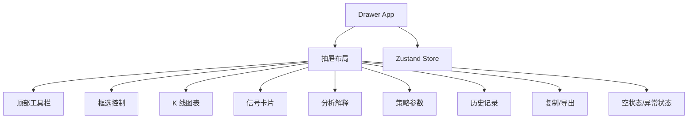
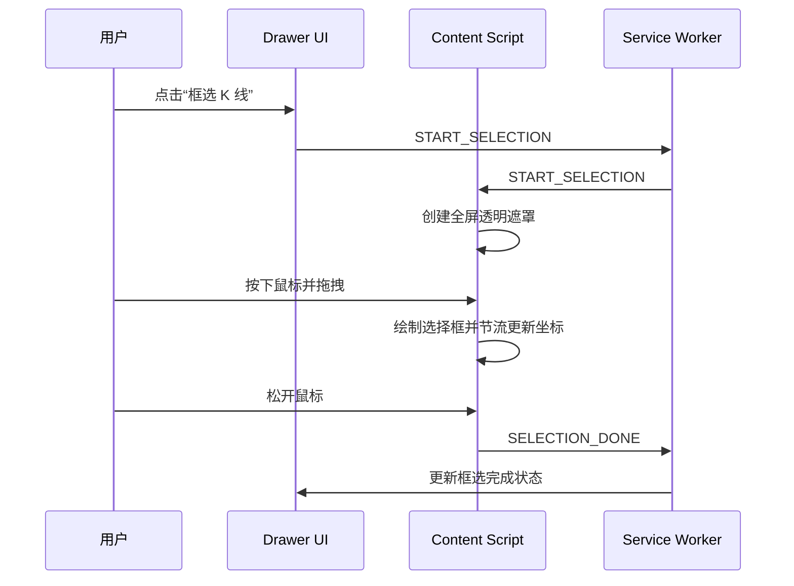
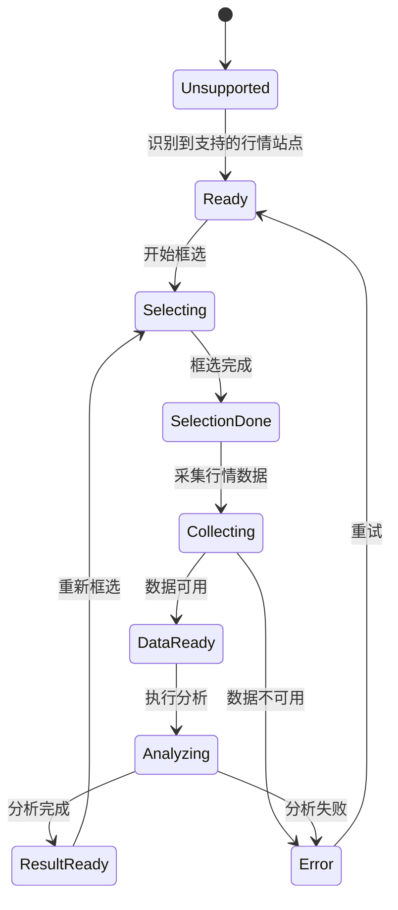

# 前端模块、侧边抽屉与页面交互设计方案

## 1. 文档说明

本文档定义 K 线分析器插件的前端模块、侧边抽屉 UI、页面框选交互、分析结果展示、配置管理、历史记录、异常状态和用户上手流程。

## 2. 设计目标

| 目标             | 说明                                |
| ---------------- | ----------------------------------- |
| 操作闭环清晰     | 用户从启用插件到查看结果不超过 4 步 |
| 页面侵入低       | 不破坏行情网站原有布局和交互        |
| 信息可解释       | 买卖点必须展示依据、置信度和风险    |
| 状态可恢复       | 抽屉关闭后可恢复最近分析结果        |
| 适配多个行情站点 | 页面识别和 UI 展示与协议采集解耦    |

## 3. 前端模块拆分



## 4. 侧边抽屉布局

```text
┌────────────────────────────────────┐
│ 标题栏：标的 / 周期 / 当前状态       │
├────────────────────────────────────┤
│ 操作区：框选、重新采集、分析、导出   │
├────────────────────────────────────┤
│ 信号区：买入 / 卖出 / 观望 / 置信度  │
├────────────────────────────────────┤
│ 图表区：标准化 K 线 + 成交量         │
├────────────────────────────────────┤
│ 解释区：维科夫阶段、量价依据、风险   │
├────────────────────────────────────┤
│ 参数区：分析周期、分析 K 线数量       │
├────────────────────────────────────┤
│ 历史区：最近分析记录                 │
└────────────────────────────────────┘
```

| 组件                  | 职责                   | 输入                | 输出              |
| --------------------- | ---------------------- | ------------------- | ----------------- |
| `DrawerShell`         | 抽屉容器、宽度、主题   | 展开状态            | 页面布局          |
| `PageStatusBar`       | 展示站点识别和数据状态 | `PageState`         | 状态标签          |
| `SelectionButton`     | 开始/取消框选          | 用户点击            | `START_SELECTION` |
| `SignalSummaryCard`   | 展示主信号             | `TradeSignal`       | 信号摘要          |
| `CandleVolumeChart`   | 展示 K 线和成交量      | `Candle[]`          | 图表              |
| `StrategyConfigPanel` | 策略参数               | `UserConfig`        | 配置变更          |
| `AnalysisHistoryList` | 历史记录               | `AnalysisHistory[]` | 记录选择          |

## 5. K 线框选交互设计



```typescript
export type SelectionRange = {
  pageUrl: string;
  tabId: number;
  viewport: {
    width: number;
    height: number;
    scrollX: number;
    scrollY: number;
    devicePixelRatio: number;
  };
  rect: { left: number; top: number; width: number; height: number };
  capturedAt: number;
};
```

## 6. 页面状态流转



## 7. 分析结果展示

| 展示区域 | 内容                               |
| -------- | ---------------------------------- |
| 主结论   | 买入、卖出、观望、风险偏高         |
| 置信度   | 0-100 分                           |
| 阶段判断 | 吸筹、洗盘、拉升、派发、下跌、未知 |
| 量价依据 | 放量、缩量、价量背离、突破、跌破   |
| 关键价位 | 支撑位、阻力位、止损参考           |
| 风险提示 | 数据不足、波动异常、趋势不明确     |

```typescript
export type TradeSignal = {
  action: 'BUY' | 'SELL' | 'HOLD' | 'RISK';
  confidence: number;
  price?: number;
  reasonCodes: string[];
  riskWarnings: LocalizedMessage[];
};
```

`action`、Wyckoff 阶段和 reason code 是稳定的内部协议值，不翻译。Drawer 通过类型完整的 i18n 映射将其展示为当前 Chrome 语言；风险与错误传递消息键及占位参数，不在核心层传递中文字符串。

## 8. 策略参数面板

| 参数                  | 默认值 | 说明                                              |
| --------------------- | -----: | ------------------------------------------------- |
| `analysisPeriod`      |   `1d` | 用户选择的日、周或月分析周期                      |
| `analysisCandleCount` |    200 | 拉取、计算和图表共同使用的 K 线数量；范围 20–1000 |

全部参数统一在 Drawer 底部的“策略设置”模块中配置。参数变化后立即写入 `chrome.storage.local`；下次点击分析时按新配置重新拉取并生成单次快照，计算与 K 线/成交量图表严格复用该快照。成交量均线、突破阈值、放量和缩量倍数由策略引擎统一维护，不作为用户参数暴露；不再提供独立 Options 页面或手动保存按钮。

## 9. 异常状态设计

| 状态             | 用户文案                         | 可操作项                           |
| ---------------- | -------------------------------- | ---------------------------------- |
| 未支持的行情页面 | 当前页面暂不支持                 | 打开 TradingView、Binance 或同花顺 |
| 未框选           | 请先框选 K 线区域                | 开始框选                           |
| 未捕获数据       | 未识别到行情接口                 | 刷新页面、切换周期                 |
| 数据不足或不完整 | 展示实际数量、所需数量或字段错误 | 调整数量、重试或提交诊断           |
| 分析失败         | 策略计算失败                     | 重试、复制错误                     |

## 10. 任务拆解

```text
T1 实现 DrawerShell 和基础布局
T2 实现 PageStatusBar 和页面状态展示
T3 实现框选按钮和 Content Script 交互
T4 实现 K 线图表和成交量图表
T5 实现信号卡片、阶段解释、风险提示
T6 实现策略参数配置面板
T7 实现历史记录列表和详情回放
T8 实现 Markdown / JSON 复制导出
T9 实现空状态、错误状态和重试流程
T10 编写组件测试和交互 E2E 测试
```
