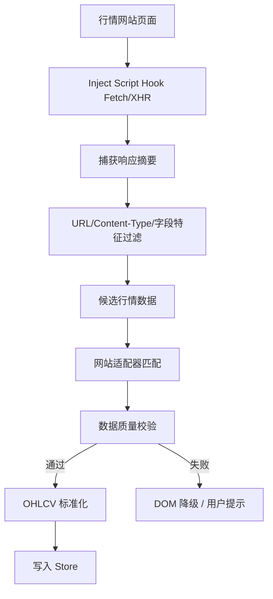
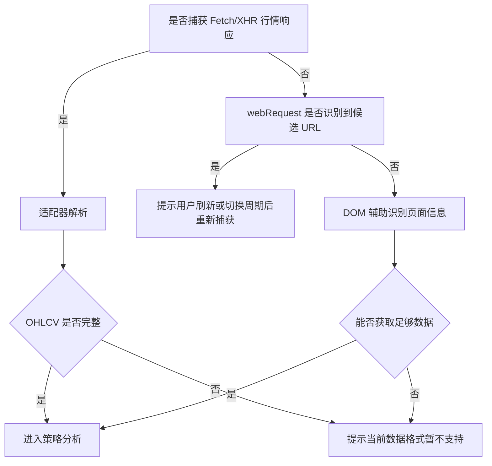

# 行情数据采集、接口嗅探与网站适配设计方案

## 1. 文档说明

本文档定义插件如何在用户访问行情网站时识别页面内行情接口、采集候选响应、解析 K 线与成交量数据、标准化为 OHLCV，并通过网站适配器隔离不同站点差异。

## 2. 设计目标

| 目标 | 说明 |
|---|---|
| 真实数据优先 | 优先使用页面真实 Fetch/XHR 响应 |
| 适配器隔离 | 每个网站的数据格式差异封装在 Adapter 内 |
| 降级可用 | 接口捕获失败时可提示或 DOM 辅助提取 |
| 不越权 | 不读取用户账号、Cookie、Token，不绕过权限 |
| 可测试 | 每个网站适配器可用样本数据做回归测试 |

## 3. 数据采集总体流程



## 4. Fetch/XHR Hook 方案

| 对象 | 捕获内容 |
|---|---|
| `window.fetch` | URL、method、status、content-type、响应 JSON/Text 样本 |
| `XMLHttpRequest.open` | method、URL |
| `XMLHttpRequest.send` | 请求发送时机 |
| `XMLHttpRequest.onload` | status、responseText 样本 |

```typescript
export type RawMarketPayload = {
  id: string;
  siteId?: string;
  url: string;
  method: "GET" | "POST";
  status: number;
  contentType?: string;
  requestAt: number;
  responseAt: number;
  source: "fetch" | "xhr" | "dom";
  raw: unknown;
  sampleText?: string;
  confidence: number;
};
```

## 5. webRequest 辅助方案

| 用途 | 说明 |
|---|---|
| URL 特征识别 | 判断是否出现 `/kline`、`/candles`、`/history` 等路径 |
| 调试诊断 | 记录请求是否发生 |
| 适配器推荐 | 帮助判断当前页面可能属于哪个站点接口 |

## 6. DOM 降级方案

| 可提取内容 | 可靠性 |
|---|---|
| 标的名称 | 高 |
| 当前周期 | 中 |
| 当前价格 | 中 |
| 图表容器位置 | 高 |
| K 线完整 OHLCV | 低 |

## 7. 网站适配器设计

```typescript
export interface SiteAdapter {
  siteId: string;
  displayName: string;
  matchPage(ctx: PageContext): boolean;
  matchPayload(payload: RawMarketPayload): AdapterMatchResult;
  parse(payload: RawMarketPayload): ParseResult<MarketData>;
  getSymbol?(ctx: PageContext, payload?: RawMarketPayload): string | undefined;
  getPeriod?(ctx: PageContext, payload?: RawMarketPayload): string | undefined;
}

export type AdapterMatchResult = { matched: boolean; confidence: number; reason: string[] };
export type ParseResult<T> = { ok: boolean; data?: T; errors?: string[]; warnings?: string[] };
```

| 维度 | 示例 |
|---|---|
| 域名 | `example-market.com` |
| URL 路径 | `/api/kline`、`/candles`、`/history` |
| Query 参数 | `symbol`、`interval`、`from`、`to` |
| JSON 字段 | `open`、`high`、`low`、`close`、`volume` |
| 数组形态 | `[time, open, high, low, close, volume]` |

## 8. OHLCV 字段映射

| 标准字段 | 含义 | 常见原始字段 |
|---|---|---|
| `timestamp` | K 线时间 | `time`、`t`、`timestamp`、数组第 0 位 |
| `open` | 开盘价 | `open`、`o`、数组第 1 位 |
| `high` | 最高价 | `high`、`h`、数组第 2 位 |
| `low` | 最低价 | `low`、`l`、数组第 3 位 |
| `close` | 收盘价 | `close`、`c`、数组第 4 位 |
| `volume` | 成交量 | `volume`、`v`、`vol`、数组第 5 位 |

## 9. 数据质量校验

| 校验项 | 规则 | 失败处理 |
|---|---|---|
| 字段完整 | 必须存在 timestamp/open/high/low/close/volume | 标记无效 |
| 数值合法 | OHLCV 必须为有限数字 | 过滤异常点 |
| 高低价关系 | `high >= max(open, close)`，`low <= min(open, close)` | 标记异常 |
| 时间递增 | timestamp 不重复且递增 | 排序、去重 |
| 数量阈值 | 默认不少于 80 根 | 提示数据不足 |
| 成交量 | volume 不小于 0 | 异常置为警告 |

## 10. 降级策略



## 11. 风险点

| 风险 | 影响 | 应对 |
|---|---|---|
| 网站接口变更 | 解析失败 | 样本回归测试、适配器隔离 |
| 响应加密或二进制 | 无法解析 | 标记站点暂不支持 |
| 页面使用 WebSocket | Fetch/XHR 捕获不到 | 后续增加 WebSocket Hook 预研 |
| 跨域 iframe | Content Script 无法访问 | MVP 暂不支持 |
| 数据单位差异 | 策略误判 | Adapter 明确单位换算 |

## 12. 任务拆解

```text
T1 实现 Inject Script Fetch Hook
T2 实现 Inject Script XHR Hook
T3 实现 Content Script postMessage 桥接
T4 定义 RawMarketPayload 和采集缓存
T5 实现接口特征过滤和候选数据去重
T6 实现 SiteAdapter 接口和 AdapterRegistry
T7 实现 OHLCV 字段映射和质量校验
T8 实现 DOM 降级识别
T9 建立 fixtures 样本目录和适配器单测
T10 编写目标网站 E2E 验证用例
```
