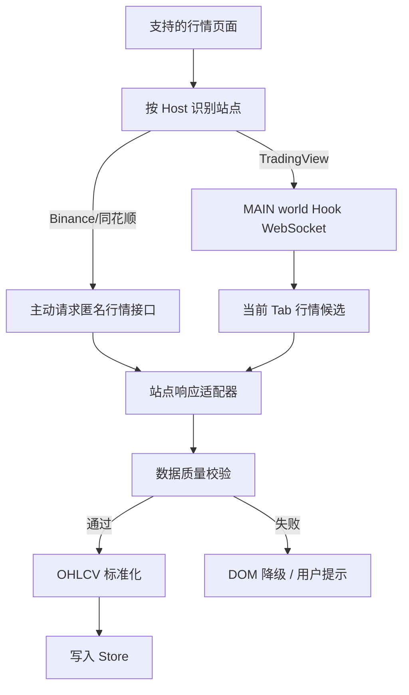
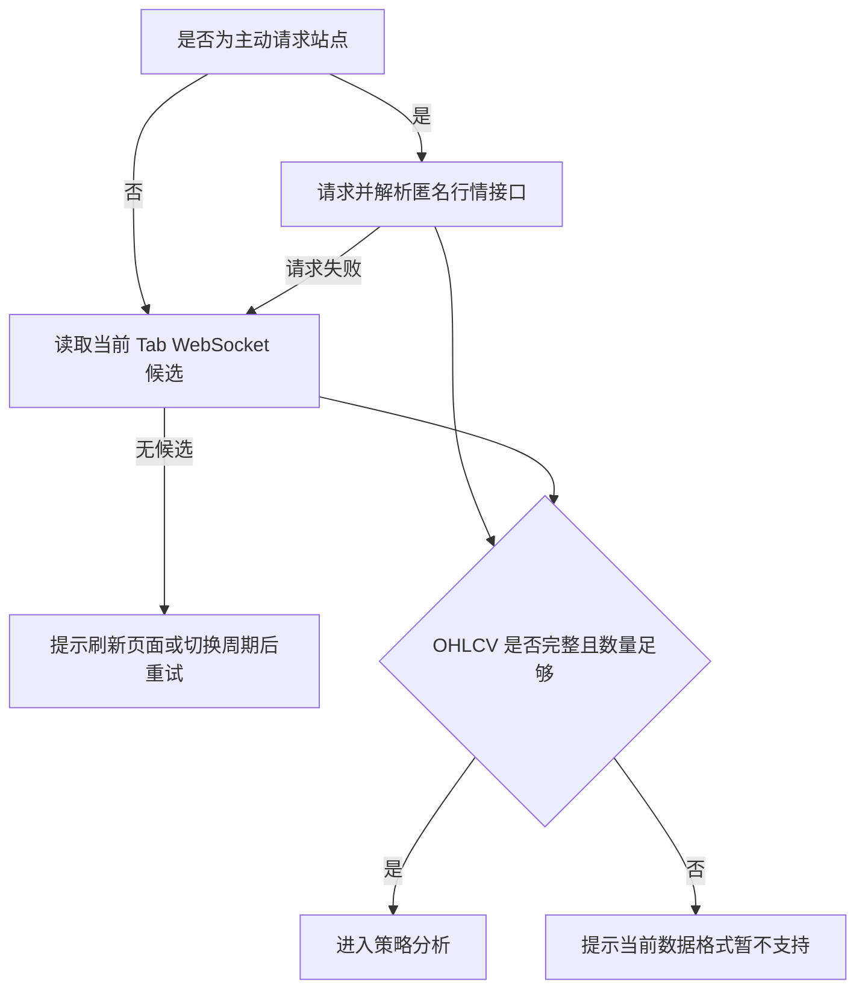

# 行情数据采集、接口嗅探与网站适配设计方案

## 1. 文档说明

本文档定义插件如何识别 TradingView、Binance 和同花顺页面，按站点选择 WebSocket 捕获或匿名行情接口主动请求，解析 K 线与成交量数据并标准化为统一 OHLCV。未注册适配器的行情网站不进入分析流程。

## 2. 设计目标

| 目标         | 说明                                         |
| ------------ | -------------------------------------------- |
| 真实数据优先 | 使用站点页面真实推送或匿名行情接口           |
| 适配器隔离   | 各站点协议、字段和周期映射封装在 Adapter 内  |
| 降级可用     | 主动请求失败时回退已捕获候选，并给出明确错误 |
| 不越权       | 不读取用户账号、Cookie、Token，不绕过权限    |
| 可测试       | 各站点适配器使用脱敏样本和请求构造单测       |

## 3. 数据采集总体流程



## 4. 站点采集路由

| 站点        | 主路径                                       | 回退路径                            |
| ----------- | -------------------------------------------- | ----------------------------------- |
| TradingView | 捕获 `timescale_update`/`du` WebSocket 帧    | 当前 Tab 中最近的有效候选           |
| Binance     | 请求 `data-api.binance.vision/api/v3/klines` | 页面已捕获的 Binance WebSocket 候选 |
| 同花顺      | 请求 `d.10jqka.com.cn/v6/line/...`           | 当前 Tab 中最近的有效候选           |

主动请求必须使用用户配置的 `analysisPeriod` 和 `analysisCandleCount` 构造周期及数量；TradingView 则从已捕获候选中选择同一页面会话的最新有效批次。

```typescript
export type RawMarketPayload = {
  id: string;
  siteId?: string;
  url: string;
  method: 'WS';
  status: number;
  contentType?: string;
  requestAt: number;
  responseAt: number;
  source: 'websocket';
  raw: unknown;
  sampleText?: string;
  confidence: number;
};
```

## 5. 主动行情请求方案

| 约束       | 说明                                                             |
| ---------- | ---------------------------------------------------------------- |
| 匿名访问   | 不附带页面 Cookie、Token 或账户信息                              |
| 数量一致   | 请求数量等于用户配置的分析 K 线数量，合法范围 20–1000            |
| 周期映射   | 日、周、月由各站点适配器转换为站点参数                           |
| 超时与错误 | 网络失败、HTTP 异常、格式错误、symbol 无法识别均转为用户可读错误 |
| 权限最小化 | Host 权限只覆盖当前使用的 Binance、同花顺匿名行情域名            |

## 6. 页面信息识别

| 可提取内容     | 可靠性              |
| -------------- | ------------------- |
| 标的名称       | 高                  |
| 当前周期       | 中                  |
| 当前价格       | 中                  |
| 图表容器位置   | 高                  |
| K 线完整 OHLCV | 不作为 DOM 读取目标 |

## 7. TradingView 适配器设计

```typescript
export interface SiteAdapter {
  siteId: string;
  displayName: string;
  matchPage(ctx: PageContext): boolean;
  matchPayload(payload: RawMarketPayload): AdapterMatchResult;
  parse(payload: RawMarketPayload): ParseResult<MarketData>;
  getSymbol?(ctx: PageContext, payload?: RawMarketPayload): string | undefined;
  getPeriod?(ctx: PageContext, payload?: RawMarketPayload): string | undefined;
}

export type AdapterMatchResult = { matched: boolean; confidence: number; reason: string[] };
export type ParseResult<T> = { ok: boolean; data?: T; errors?: string[]; warnings?: string[] };
```

| 维度     | TradingView 约束                                      |
| -------- | ----------------------------------------------------- |
| 域名     | `tradingview.com` 及其子域名                          |
| 传输     | WebSocket 长连接                                      |
| 消息类型 | `timescale_update`、`du`                              |
| 帧格式   | `~m~<length>~m~<json>` 长度前缀，可在单帧拼接多条消息 |
| K 线字段 | `time`、`open`、`high`、`low`、`close`、`volume`      |

| 站点    | 标的识别                                      | 周期/数量传递            | 响应解析          |
| ------- | --------------------------------------------- | ------------------------ | ----------------- |
| Binance | 从交易页面 URL 识别交易对                     | `interval` + `limit`     | 数组型 Kline 响应 |
| 同花顺  | 从 `stockpage.10jqka.com.cn` URL 识别股票代码 | 周期路径 + `last{count}` | JSONP 行情响应    |

## 8. OHLCV 字段映射

| 标准字段    | 含义     | 常见原始字段                          |
| ----------- | -------- | ------------------------------------- |
| `timestamp` | K 线时间 | `time`、`t`、`timestamp`、数组第 0 位 |
| `open`      | 开盘价   | `open`、`o`、数组第 1 位              |
| `high`      | 最高价   | `high`、`h`、数组第 2 位              |
| `low`       | 最低价   | `low`、`l`、数组第 3 位               |
| `close`     | 收盘价   | `close`、`c`、数组第 4 位             |
| `volume`    | 成交量   | `volume`、`v`、`vol`、数组第 5 位     |

## 9. 数据质量校验

| 校验项     | 规则                                                  | 失败处理               |
| ---------- | ----------------------------------------------------- | ---------------------- |
| 字段完整   | 必须存在 timestamp/open/high/low/close/volume         | 标记无效               |
| 数值合法   | OHLCV 必须为有限数字                                  | 过滤异常点             |
| 高低价关系 | `high >= max(open, close)`，`low <= min(open, close)` | 标记异常               |
| 时间递增   | timestamp 不重复且递增                                | 排序、去重             |
| 数量阈值   | 系统下限 20 根，且必须达到用户配置的分析数量          | 抛出实际数量与所需数量 |
| 成交量     | volume 不小于 0                                       | 异常置为警告           |

## 10. 降级策略



## 11. 风险点

| 风险             | 影响                    | 应对                     |
| ---------------- | ----------------------- | ------------------------ |
| 网站接口变更     | 解析失败                | 样本回归测试、适配器隔离 |
| 响应加密或二进制 | 无法解析                | 标记站点暂不支持         |
| WebSocket 帧变化 | TradingView 解析失败    | 脱敏帧回归、协议错误提示 |
| 跨域 iframe      | Content Script 无法访问 | MVP 暂不支持             |
| 数据单位差异     | 策略误判                | Adapter 明确单位换算     |

## 12. 任务拆解

```text
T1 实现 MAIN world WebSocket Hook
T2 实现 Content Script postMessage 桥接
T3 定义 MarketSite、RawMarketPayload 和按 Tab 隔离的采集缓存
T4 实现站点注册表、页面识别和候选数据去重
T5 实现 TradingView WebSocket 适配器
T6 实现 Binance、同花顺主动请求与响应适配器
T7 实现统一 OHLCV 字段映射和质量校验
T8 实现请求超时、候选回退和错误反馈
T9 建立 fixtures 样本目录和适配器单测
T10 编写三个支持站点的 E2E 验证用例
```
