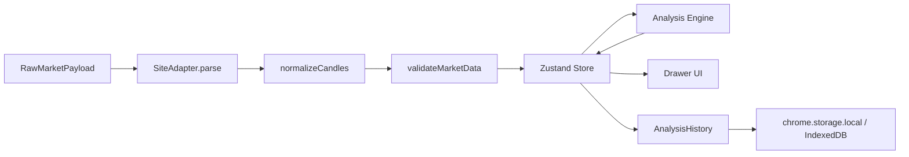
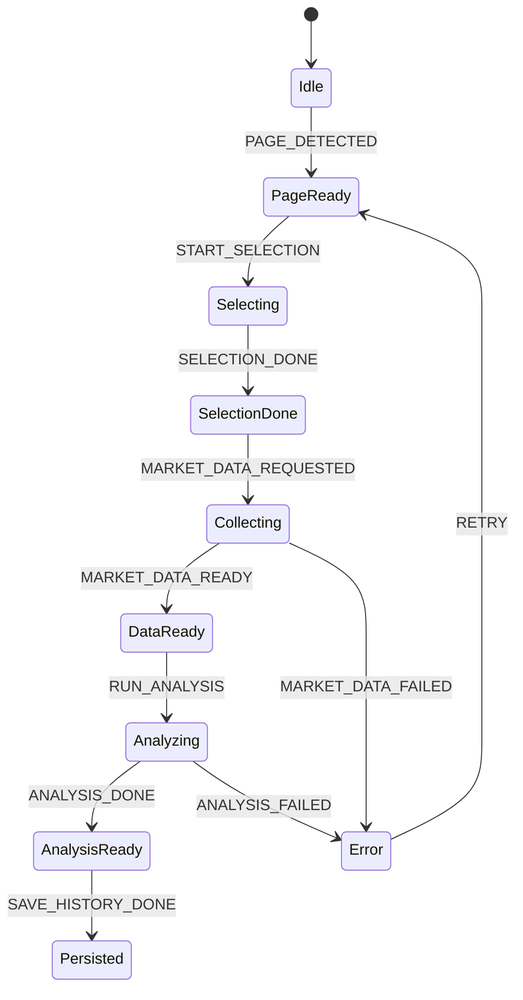

# K 线数据模型、数据流与状态管理方案

## 1. 文档说明

本文档定义插件内部核心数据结构、OHLCV 标准模型、数据流、状态管理、本地缓存、配置和历史记录方案。后续编码时，本文档是 TypeScript 类型定义和 Store 设计的主要输入。

## 2. 设计目标

| 目标   | 说明                                          |
| ------ | --------------------------------------------- |
| 标准化 | 所有行情站点最终转为统一 OHLCV 模型           |
| 可追溯 | 保留数据来源、适配器、采集时间和质量信息      |
| 可恢复 | Service Worker 挂起或页面刷新后可恢复关键状态 |
| 可测试 | 模型、状态迁移、缓存读写都能单测              |
| 可扩展 | 后续可增加指标、策略和多周期数据              |

## 3. 数据流总览



## 4. 核心数据模型

```typescript
export type Candle = {
  timestamp: number;
  open: number;
  high: number;
  low: number;
  close: number;
  volume: number;
};

export type MarketData = {
  id: string;
  siteId: string;
  symbol?: string;
  period?: string;
  timezone?: string;
  candles: Candle[];
  source: { url: string; adapterId: string; capturedAt: number };
  quality: DataQuality;
};

export type DataQuality = {
  valid: boolean;
  candleCount: number;
  missingFields: string[];
  warnings: LocalizedMessage[];
  score: number;
};
```

`LocalizedMessage` 只包含稳定消息键和可选占位参数；到 Popup/Drawer 展示边界才通过 `chrome.i18n` 解析为英文或简体中文。

| 字段        | 类型     | 必填 | 说明       |
| ----------- | -------- | ---- | ---------- |
| `timestamp` | `number` | 是   | 毫秒时间戳 |
| `open`      | `number` | 是   | 开盘价     |
| `high`      | `number` | 是   | 最高价     |
| `low`       | `number` | 是   | 最低价     |
| `close`     | `number` | 是   | 收盘价     |
| `volume`    | `number` | 是   | 成交量     |

## 5. 用户配置模型

```typescript
export type UserConfig = {
  analysisPeriod: '1d' | '1w' | '1M';
  analysisCandleCount: number;
};
```

`analysisCandleCount` 的合法范围为 20–1000，默认 200。它同时决定单次分析所需的 K 线数量和图表渲染数量；策略阈值属于引擎内部版本化常量，不进入用户配置或持久化数据。

## 6. 状态管理方案

推荐使用 Zustand 管理 Drawer UI 与分析任务状态。Service Worker 侧使用轻量 Map 管理 Tab Session，不依赖 React Store。

```typescript
export type AnalyzerState = {
  page: PageState;
  selection?: SelectionRange;
  marketData?: MarketData;
  analysis?: WyckoffAnalysisResult;
  config: UserConfig;
  history: AnalysisHistory[];
  loading: LoadingState;
  error?: ExtensionError;
};
```

## 7. 状态流转



## 8. 本地存储设计

| 存储内容   | 存储方案               | Key                | 说明               |
| ---------- | ---------------------- | ------------------ | ------------------ |
| 用户配置   | `chrome.storage.local` | `kla:userConfig`   | 体积小，需快速读取 |
| 最近状态   | `chrome.storage.local` | `kla:lastSession`  | 页面恢复使用       |
| 分析历史   | IndexedDB              | `analysis_history` | 记录较多，便于索引 |
| 调试日志   | 不默认持久化           | -                  | 仅开发环境按需输出 |
| 适配器缓存 | `chrome.storage.local` | `kla:adapterHints` | 保存站点识别提示   |

## 9. 缓存策略

| 数据         | 默认保留 | 淘汰规则                 |
| ------------ | -------: | ------------------------ |
| 分析历史     |   100 条 | 超出后按时间删除最旧记录 |
| 原始响应样本 | 不持久化 | 仅内存短期缓存           |
| 调试日志     |     7 天 | 超期清理                 |
| 配置         |     长期 | 用户手动重置             |

## 10. 边界条件

| 场景              | 处理方式                         |
| ----------------- | -------------------------------- |
| 时间戳秒/毫秒混用 | Adapter 内统一转毫秒             |
| K 线倒序返回      | 标准化阶段排序                   |
| 重复 K 线         | 按 timestamp 去重，保留最新      |
| 缺成交量          | 标记数据不可用于维科夫分析       |
| 数据过大          | 只保留当前分析窗口，历史保存摘要 |

## 11. 任务拆解

```text
T1 定义 Candle、MarketData、DataQuality、UserConfig 类型
T2 实现 normalizeCandles、validateMarketData
T3 实现 Zustand Store 和 action
T4 实现 chrome.storage.local 配置读写
T5 实现 IndexedDB 历史记录仓储
T6 实现 Service Worker TabSession 管理
T7 实现缓存淘汰和历史清理
T8 编写模型、状态迁移、缓存读写单元测试
```
