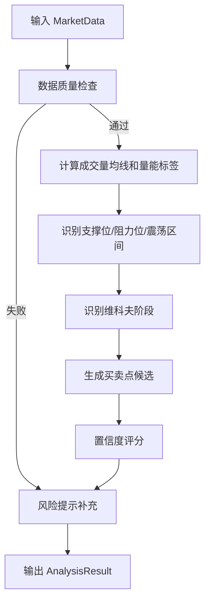
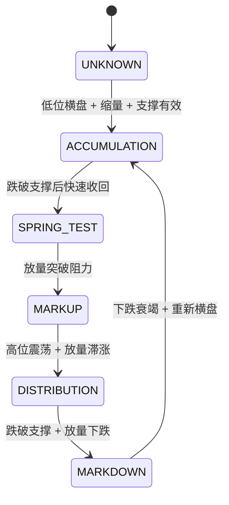

# 维科夫量价策略分析引擎设计方案

## 1. 文档说明

本文档定义插件核心策略分析引擎：成交量分析、维科夫阶段识别、支撑阻力识别、买点卖点规则、置信度评分、风险提示和策略边界。本文档是后续实现 `core/analysis` 模块的主要输入。

## 2. 设计目标

| 目标       | 说明                                     |
| ---------- | ---------------------------------------- |
| 可解释     | 每个信号必须给出量价依据和原因码         |
| 可配置     | 用户配置分析周期和分析 K 线数量          |
| 可测试     | 每条规则可基于样本 K 线单元测试          |
| 可降级     | 数据不足时输出观望和风险，不强行给买卖点 |
| 非投资建议 | 明确输出为技术分析参考                   |

## 3. 输入输出

```typescript
export type AnalysisRequest = {
  marketData: MarketData;
  selection?: SelectionRange;
  config: UserConfig;
};

export type WyckoffAnalysisResult = {
  id: string;
  stage: WyckoffStage;
  signal: TradeSignal;
  volumeSummary: VolumeSummary;
  keyLevels: KeyLevels;
  evidence: EvidenceItem[];
  warnings: LocalizedMessage[];
  createdAt: number;
};

export type WyckoffStage =
  | 'ACCUMULATION'
  | 'SPRING_TEST'
  | 'MARKUP'
  | 'DISTRIBUTION'
  | 'MARKDOWN'
  | 'UNKNOWN';
```

`WyckoffStage`、`TradeAction`、`EvidenceCode` 和错误代码均是可测试、可持久、可通信的稳定机器值，始终保持英文。人类可读文案只在 UI 展示层完成本地化。

## 4. 策略计算流程



## 5. 成交量分析

| 指标       | 计算方式                                           | 用途                     |
| ---------- | -------------------------------------------------- | ------------------------ |
| 成交量均线 | `SMA(volume, STRATEGY_DEFAULTS.volumeMaPeriod)`    | 判断放量/缩量            |
| 放量       | `volume > ma * STRATEGY_DEFAULTS.volumeSpikeRatio` | 突破、派发、恐慌下跌识别 |
| 缩量       | `volume < ma * STRATEGY_DEFAULTS.lowVolumeRatio`   | 洗盘、回踩、供应枯竭识别 |
| 价量同步   | 价格上涨且成交量放大                               | 趋势确认                 |
| 价量背离   | 价格新高但成交量下降                               | 派发风险                 |

## 6. 维科夫阶段识别



| 阶段          | 识别条件                                 | 输出倾向       |
| ------------- | ---------------------------------------- | -------------- |
| 吸筹          | 低位区间震荡、下跌量能衰减、支撑反复有效 | 观察潜在买点   |
| Spring / 测试 | 跌破支撑后快速收回、缩量回踩             | 激进买点候选   |
| 拉升          | 放量突破阻力、回踩不破、价量同步         | 顺势买点或持有 |
| 派发          | 高位放量滞涨、价量背离、上影线增加       | 减仓或卖点候选 |
| 下跌          | 跌破关键支撑、放量下跌、反弹缩量         | 风险规避       |
| 未知          | 数据不足或信号冲突                       | 观望           |

## 7. 买点规则

| 规则编号 | 条件                      | 信号     | 置信度加分 |
| -------- | ------------------------- | -------- | ---------: |
| B001     | Spring 跌破支撑后快速收回 | BUY      |         20 |
| B002     | 回踩支撑缩量不破          | BUY      |         15 |
| B003     | 放量突破阻力并站稳        | BUY      |         20 |
| B004     | 吸筹区间低位出现供应枯竭  | HOLD/BUY |         10 |
| B005     | 趋势拉升中回踩均线缩量    | BUY      |         10 |

## 8. 卖点规则

| 规则编号 | 条件                 | 信号      | 置信度加分 |
| -------- | -------------------- | --------- | ---------: |
| S001     | 高位放量滞涨         | SELL      |         20 |
| S002     | 价格新高但成交量下降 | SELL      |         15 |
| S003     | 跌破关键支撑并放量   | SELL      |         25 |
| S004     | 派发区间多次冲高回落 | SELL      |         15 |
| S005     | 下跌趋势反弹缩量     | HOLD/RISK |         10 |

## 9. 置信度评分

```typescript
export type ConfidenceScore = {
  total: number;
  components: Array<{ code: string; name: string; score: number; reason: string }>;
};
```

| 维度       |     权重 | 说明                             |
| ---------- | -------: | -------------------------------- |
| 数据质量   |       20 | K 线数量、字段完整性、时间连续性 |
| 阶段明确度 |       25 | 维科夫阶段是否清晰               |
| 量价一致性 |       25 | 价格与成交量是否相互确认         |
| 关键价位   |       15 | 支撑/阻力是否明确                |
| 风险惩罚   | -30 到 0 | 数据不足、波动异常、信号冲突扣分 |

## 10. 风险提示

| 风险       | 触发条件                                                           | 输出                                                            |
| ---------- | ------------------------------------------------------------------ | --------------------------------------------------------------- |
| 数据不足   | 有效 K 线少于用户配置的 `analysisCandleCount`，或少于系统下限 5 根 | 抛出明确错误，不生成分析结果；5–19 根输出短样本警告并限制置信度 |
| 波动异常   | 单根 K 线振幅远超均值                                              | 降低置信度                                                      |
| 成交量缺失 | volume 为空或全 0                                                  | 禁用维科夫判断                                                  |
| 信号冲突   | 买卖规则同时触发                                                   | 输出观望                                                        |
| 横盘无方向 | 区间内无有效突破                                                   | 输出等待确认                                                    |

## 11. 策略边界

1. 维科夫策略依赖量价数据质量，不能在无成交量数据时可靠工作。
2. 插件不进行基本面、新闻面、资金费率、盘口深度分析。
3. 插件不预测未来价格，只基于已发生 K 线给出技术分析参考。
4. 当前策略阈值由引擎统一版本化维护，不向用户暴露相互依赖的底层参数；后续应基于不同市场和周期的真实样本校准。

## 12. 任务拆解

```text
T1 实现成交量均线、放量、缩量、价量背离工具函数
T2 实现支撑位、阻力位、震荡区间识别
T3 实现维科夫阶段识别器
T4 实现买点规则和卖点规则
T5 实现置信度评分器
T6 实现风险提示生成器
T7 建立策略样本 fixtures
T8 编写规则级单元测试和回归测试
```
