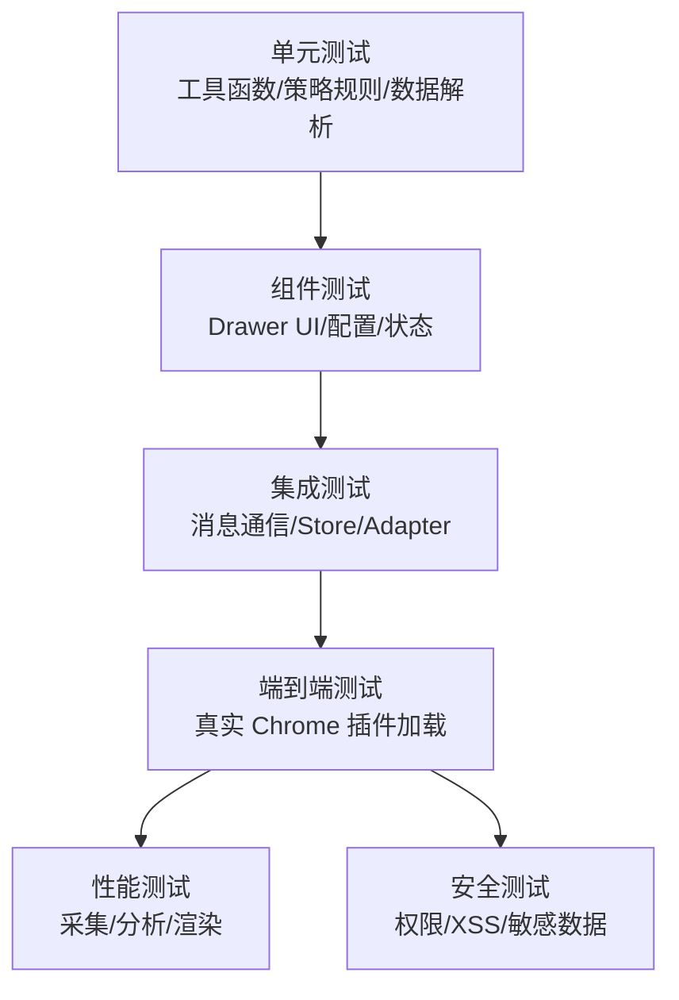
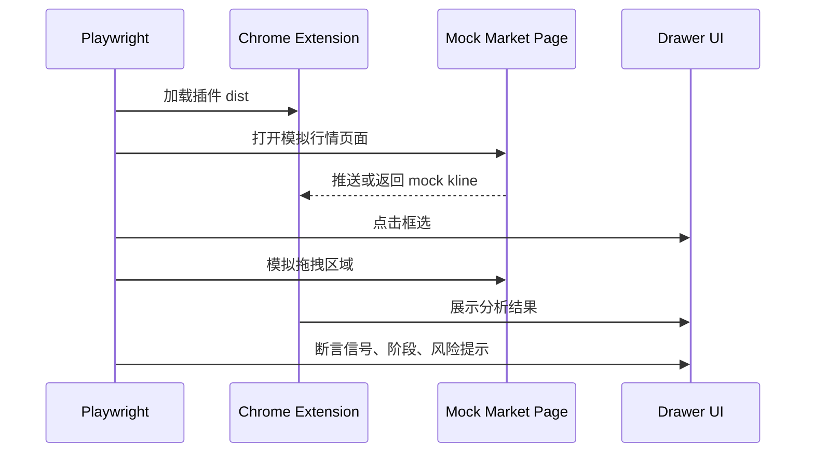

# 测试、验收、性能与兼容性方案

## 1. 文档说明

本文档定义 K 线分析器插件的测试分层、验收标准、性能指标、兼容性矩阵、安全测试和上线质量门禁。

## 2. 测试目标

| 目标     | 说明                                         |
| -------- | -------------------------------------------- |
| 功能正确 | 框选、采集、解析、分析、展示链路闭环         |
| 策略可信 | 固定样本下策略输出稳定、可解释               |
| 性能可控 | 大数据量分析不造成页面卡顿                   |
| 兼容可测 | 三个支持站点、浏览器版本、缩放比例有明确矩阵 |
| 发布可控 | 上线前有准入准出标准                         |

## 3. 测试分层



## 4. 单元测试

| 模块       | 测试重点                            | 工具   |
| ---------- | ----------------------------------- | ------ |
| 数据标准化 | 字段映射、排序、去重、异常过滤      | Vitest |
| 站点适配器 | 脱敏响应/帧解析、请求构造、异常过滤 | Vitest |
| 策略引擎   | 阶段识别、买卖点规则、评分          | Vitest |
| Store      | 状态迁移、错误状态、缓存恢复        | Vitest |
| 工具函数   | 均线、支撑阻力、统计计算            | Vitest |

## 5. E2E 测试流程



## 6. 性能指标

| 指标                  |       目标 | 测试方式         |
| --------------------- | ---------: | ---------------- |
| Content Script 初始化 |     < 50ms | Performance API  |
| WebSocket Hook 开销   | 单帧 < 5ms | Mock 帧压测      |
| 1000 根 K 线解析      |    < 100ms | Vitest benchmark |
| 1000 根 K 线分析      |    < 300ms | Vitest benchmark |
| Drawer 首次打开       |    < 300ms | Playwright       |
| 拖拽框选帧率          | 无明显卡顿 | E2E + 手工验证   |

## 7. 兼容性矩阵

| 类型     | 覆盖范围                                        |
| -------- | ----------------------------------------------- |
| 浏览器   | Chrome 最新稳定版、Edge 最新稳定版              |
| 页面缩放 | 90%、100%、125%、150%                           |
| 分辨率   | 1366x768、1920x1080、2560x1440                  |
| 主题     | 明亮、暗色                                      |
| 网站     | TradingView、Binance、同花顺各至少 1 个目标页面 |
| 周期     | 日、周、月周期，以及站点周期映射边界            |

## 8. 安全测试

| 测试项     | 验证方式                                   |
| ---------- | ------------------------------------------ |
| 权限最小化 | 检查 Manifest 权限清单                     |
| 敏感数据   | 搜索 storage 和日志中是否存在 Cookie/Token |
| XSS        | 模拟恶意 symbol 和接口字段                 |
| CSP        | 检查无远程脚本、无 inline eval             |
| 消息校验   | 非法消息类型和 payload 不被执行            |

## 9. 验收标准

| 验收项     | 标准                                         |
| ---------- | -------------------------------------------- |
| 插件加载   | dist 可被 Chrome 开发者模式加载，无红色错误  |
| 框选交互   | 框选区域坐标正确，取消和重试正常             |
| 数据采集   | 三个支持站点均能获得足量且身份正确的行情数据 |
| 适配器解析 | 样本解析通过率 100%                          |
| 策略分析   | 规则样本输出符合预期                         |
| UI 展示    | 信号、解释、风险、参数、历史完整             |
| 性能       | 达成性能指标表中的目标                       |
| 安全       | 不保存敏感身份信息                           |

## 10. 准入准出

| 阶段     | 准入                   | 准出                     |
| -------- | ---------------------- | ------------------------ |
| 开发联调 | 基础框架可运行         | 主链路跑通               |
| 测试提测 | 单测通过，构建成功     | P0/P1 缺陷清零           |
| 灰度     | E2E 通过，发布包可加载 | 关键指标稳定，无高危反馈 |
| 正式发布 | 灰度通过，回滚包准备   | 上线观察无阻塞问题       |

## 11. 任务拆解

```text
T1 配置 Vitest 和测试覆盖率
T2 建立 adapter fixtures 和策略 fixtures
T3 编写数据标准化与适配器测试
T4 编写策略规则测试
T5 编写 Store 和消息通信测试
T6 搭建 Playwright 插件 E2E 测试
T7 编写性能 benchmark
T8 编写安全检查脚本和上线验收清单
```
