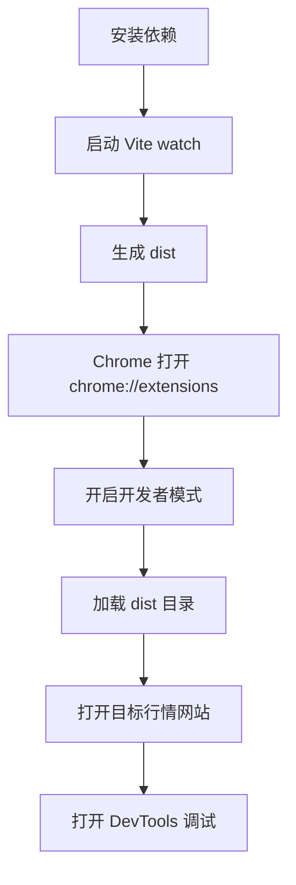
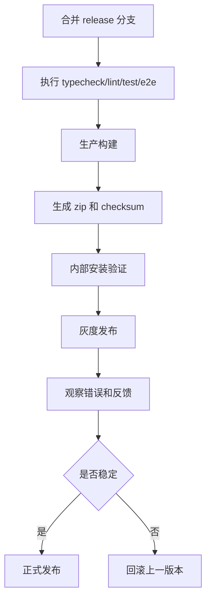

# 构建发布、开发调试、运维排障与上线方案

## 1. 文档说明

本文档定义 Chrome K 线分析器插件的工程目录、开发启动、调试流程、构建打包、版本管理、灰度发布、回滚、运维排障和应急预案。

## 2. 设计目标

| 目标       | 说明                                                 |
| ---------- | ---------------------------------------------------- |
| 新人可上手 | 30 分钟内完成本地插件加载                            |
| 调试可定位 | Content、Inject、Service Worker、Drawer 均有调试入口 |
| 构建可复现 | 使用锁定依赖和固定脚本产物                           |
| 发布可回滚 | 每个版本保留 zip 和变更记录                          |
| 问题可诊断 | 支持导出诊断包和错误码                               |

## 3. 推荐目录结构

```text
src/
  background/
    index.ts
    message-router.ts
    tab-session.ts
  content/
    index.ts
    selection-overlay.ts
    inject-bridge.ts
  inject/
    index.ts
    fetch-hook.ts
    xhr-hook.ts
  drawer/
    App.tsx
    components/
    store/
  popup/
  options/
  core/
    adapter/
    analysis/
    model/
    storage/
  shared/
    messages.ts
    errors.ts
    logger.ts
fixtures/
  adapters/
  strategies/
tests/
  unit/
  e2e/
```

## 4. 开发启动流程



## 5. 开发命令示例

```json
{
  "scripts": {
    "dev": "vite build --watch --mode development",
    "build": "vite build --mode production",
    "test": "vitest run",
    "test:watch": "vitest",
    "test:e2e": "playwright test",
    "lint": "eslint src --ext .ts,.tsx",
    "typecheck": "tsc --noEmit",
    "package": "node scripts/package-extension.mjs"
  }
}
```

## 6. 调试指南

| 对象           | 调试入口                          | 重点                     |
| -------------- | --------------------------------- | ------------------------ |
| Service Worker | `chrome://extensions` 插件详情页  | 消息路由、Tab 状态、权限 |
| Content Script | 目标页面 DevTools Sources         | 框选遮罩、DOM、桥接      |
| Inject Script  | 目标页面主世界 Console            | WebSocket Hook 是否生效  |
| Drawer UI      | Drawer iframe 或注入容器 DevTools | React 状态、组件渲染     |
| Storage        | DevTools Application              | 配置、历史、缓存         |

## 7. 构建产物

```text
dist/
  manifest.json
  background.js
  content.js
  inject.js
  drawer.html
  drawer.js
  popup.html
  assets/
release/
  k-line-analyzer-0.1.3.zip
  checksums.txt
  release-notes.md
```

## 8. 发布流程

本地调试运行 `npm run dev`，使用 `manifest.dev.json`；生产构建和发布运行 `npm run build` / `npm run package`，强制使用 `manifest.prod.json`。发布审计会比较产物与生产清单，并拒绝 `localhost`、`127.0.0.1`、缺失图标或不可达构建文件。隐私政策、Web Store 数据披露和商店素材分别维护在 `PRIVACY.md`、`docs/WEB_STORE_LISTING.md` 与 `store-assets/`。



## 9. 版本规范

| 类型     | 示例           | 说明                        |
| -------- | -------------- | --------------------------- |
| 主版本   | `1.0.0`        | 重大架构或不兼容变更        |
| 次版本   | `0.2.0`        | 新策略、新 UI、重要能力扩展 |
| 修订版本 | `0.1.3`        | 缺陷修复、框选与交互优化    |
| 预发布   | `0.2.0-beta.1` | 灰度或内部测试              |

## 10. 应急预案

| 场景               | 处理                                                 |
| ------------------ | ---------------------------------------------------- |
| 某站点协议失效     | 仅禁用对应站点分析并明确提示，更新适配器后发布热修复 |
| 插件无法加载       | 回滚上一版本，检查 Manifest 和构建产物               |
| 策略输出异常       | 关闭强信号，仅输出观望和风险提示                     |
| 性能卡顿           | 降低分析窗口，延迟计算，禁用重型图表                 |
| 发布审核失败       | 缩减权限，补充权限说明，重新提交                     |
| 用户误解为投资建议 | 强化免责声明，调整 UI 文案                           |

## 11. 诊断包

```typescript
export type DiagnosticPackage = {
  version: string;
  browser: string;
  pageUrl: string;
  siteId?: string;
  permissions: string[];
  recentErrors: ExtensionError[];
  adapterMatches: AdapterMatchResult[];
  dataQuality?: DataQuality;
  createdAt: number;
};
```

诊断包不包含 Cookie、Token、账号、手机号、邮箱、交易账户等敏感信息。

## 12. 上线检查清单

| 检查项                                 | 是否必须 |
| -------------------------------------- | -------- |
| Manifest 权限已最小化                  | 是       |
| 三个支持站点及主动行情接口白名单已确认 | 是       |
| 单元测试通过                           | 是       |
| E2E 主链路通过                         | 是       |
| 生产构建无 sourcemap 泄漏敏感信息      | 是       |
| release zip 可安装                     | 是       |
| 回滚包已准备                           | 是       |
| 免责声明已展示                         | 是       |

## 13. 任务拆解

```text
T1 初始化 Vite 多入口构建
T2 配置 ESLint、TypeScript、Vitest、Playwright
T3 编写 package-extension.mjs 打包脚本
T4 编写 release notes 和 checksum 生成脚本
T5 实现 debug logger 和诊断包导出
T6 编写开发者上手指南
T7 编写 Chrome 加载和调试指南
T8 建立发布检查清单和回滚流程
```
