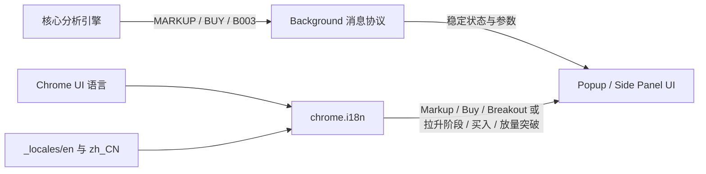
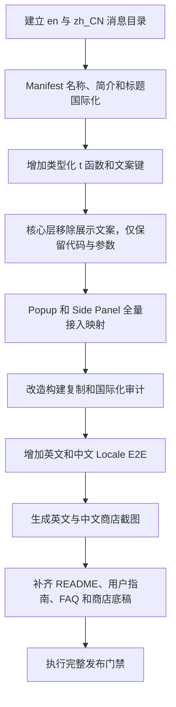

# 国际化与双语发布实施方案

## 1. 文档说明

本文档定义 K Line Analyzer 在英文和简体中文环境下的国际化架构、代码边界、Manifest 本地化、Chrome Web Store 双语发布、商店素材、公开用户文档、构建校验与验收标准。

本方案基于当前仓库实现制定，适用于 Popup、Chrome Side Panel、Background Service Worker、核心分析引擎、构建脚本、商店发布材料和公开用户说明文档。

## 2. 最终目标

| 目标             | 说明                                                                                      |
| ---------------- | ----------------------------------------------------------------------------------------- |
| 英文默认         | `default_locale` 固定为 `en`，未支持的 Chrome 语言统一回退英文                            |
| 保留简体中文     | Chrome UI 语言为简体中文时使用 `zh_CN` 文案，服务同花顺和 A 股用户                        |
| UI 全量国际化    | Popup、Side Panel、错误、警告、策略结论、阶段、判断依据、可访问性文本全部通过语言资源展示 |
| 内部状态语言无关 | `BUY`、`MARKUP`、`B003` 等代码、协议和状态关键字始终保持英文，不属于国际化内容            |
| 插件名称国际化   | Manifest 名称、简介和 Action 标题跟随 Chrome 语言                                         |
| 商店双语发布     | Chrome Web Store 默认英文 Listing，并提供简体中文本地化 Listing 和截图                    |
| 用户文档双语     | README、使用指南、FAQ、商店填写底稿等用户可阅读资料均提供英文和简体中文入口               |
| 视觉保持稳定     | 高级蓝品牌主题、图标、行情涨跌色和图表结构不因语言改变                                    |
| 业务行为不变     | 不改变多站点采集、TradingView 被动模式、参数锁定和统一 K 线窗口                           |

## 3. 核心设计原则

### 3.1 状态关键字不属于国际化

业务状态、错误码、原因码、消息类型和存储字段是稳定机器协议，必须保持英文：

```typescript
type TradeAction = 'BUY' | 'SELL' | 'HOLD' | 'RISK';

type WyckoffStage =
  | 'ACCUMULATION'
  | 'SPRING_TEST'
  | 'MARKUP'
  | 'DISTRIBUTION'
  | 'MARKDOWN'
  | 'UNKNOWN';

type VolumeLabel = 'SPIKE' | 'LOW' | 'NORMAL';
```

以下内容不得翻译或替换为中文：

- TypeScript 联合类型和枚举值；
- Background 与 Drawer 之间传输的状态值；
- `chrome.storage.local` 中的业务配置和值；
- `B001`、`B003`、`S002`、`PRICE_ONLY` 等分析原因码；
- `E_ANALYSIS_FAILED`、`E_PAGE_CONTEXT_CHANGED` 等错误码；
- 单元测试对核心分析结果的断言。

禁止出现以下实现：

```typescript
// 错误：状态值随语言变化，破坏协议稳定性。
result.signal.action = locale === 'zh_CN' ? '买入' : 'BUY';
```

### 3.2 只有用户可见文本进入语言资源

国际化对象包括：

- 页面标题、按钮、标签、说明和状态提示；
- `title`、`aria-label` 等可访问性文本；
- 错误、警告、空状态和隐私提示；
- 状态关键字对应的显示标签；
- 分析依据的标题和解释；
- Manifest 名称、简介和 Action 提示；
- Chrome Web Store 商店文案；
- 面向用户的公开说明文档。

正确的数据流是：



### 3.3 核心层不依赖 `chrome.i18n`

`src/core/**` 应保持纯 TypeScript 业务逻辑，不能直接调用 `chrome.i18n`。这样可以保证：

- 分析结果与浏览器语言无关；
- 核心单元测试无需模拟 Chrome API；
- 同一分析结果可以在任意语言 UI 中重新渲染；
- 后续新增语言不需要修改策略引擎。

### 3.4 英文是回退语言，不是内部状态的替代品

英文默认只影响用户可见文案。内部状态本来就使用稳定英文关键字，两者必须区分：

- 内部状态：`MARKUP`；
- 英文显示：`Markup`；
- 中文显示：`拉升阶段`。

## 4. 语言范围与回退规则

首版正式支持以下 locale：

```text
_locales/
  en/
    messages.json
  zh_CN/
    messages.json
```

| Chrome UI 语言                    | 插件语言 |
| --------------------------------- | -------- |
| `en`、`en-US`、`en-GB` 等英文环境 | 英文     |
| `zh-CN`                           | 简体中文 |
| 其他未支持语言                    | 英文     |

本期不增加插件内语言选择器，不在 `chrome.storage.local` 保存 locale，也不使用页面语言或行情网站语言判断插件语言。

繁体中文不是本期范围。`zh-TW`、`zh-HK` 等环境在未提供对应 locale 时回退英文；若后续支持繁体中文，应新增独立 `zh_TW/messages.json`，不能改变 `zh_CN` 的含义。

## 5. 推荐目录结构

```text
_locales/
  en/messages.json
  zh_CN/messages.json

src/shared/
  i18n.ts
  i18n-keys.ts
  localized-message.ts

tests/
  i18n.test.ts

scripts/
  verify-i18n.mjs

docs/
  USER_GUIDE.md
  USER_GUIDE.zh-CN.md
  FAQ.md
  FAQ.zh-CN.md
  WEB_STORE_LISTING.md
  WEB_STORE_LISTING.zh-CN.md

README.md
README.zh-CN.md
PRIVACY.md
```

## 6. Manifest 国际化

### 6.1 生产 Manifest

`manifest.prod.json` 调整为：

```json
{
  "manifest_version": 3,
  "default_locale": "en",
  "name": "__MSG_extension_name__",
  "description": "__MSG_extension_description__",
  "action": {
    "default_title": "__MSG_action_title__"
  }
}
```

### 6.2 开发 Manifest

开发构建使用独立文案键，避免与正式插件混淆：

```json
{
  "default_locale": "en",
  "name": "__MSG_extension_name_dev__",
  "description": "__MSG_extension_description_dev__",
  "action": {
    "default_title": "__MSG_action_title_dev__"
  }
}
```

### 6.3 名称建议

| 键                   | 英文                  | 简体中文                 |
| -------------------- | --------------------- | ------------------------ |
| `extension_name`     | K Line Analyzer       | K 线量价分析器           |
| `extension_name_dev` | K Line Analyzer (Dev) | K 线量价分析器（开发版） |
| `action_title`       | Open K Line Analyzer  | 打开 K 线量价分析器      |

Manifest 只引用 `__MSG_xxx__`，不能直接写中英文条件判断。

## 7. 运行时国际化基础设施

### 7.1 文案键类型

新增 `src/shared/i18n-keys.ts`，集中定义用户可见文案键：

```typescript
export type MessageKey =
  | 'popup_title'
  | 'popup_open_panel'
  | 'drawer_title'
  | 'action_buy'
  | 'stage_markup'
  | 'evidence_b003_label'
  | 'evidence_b003_detail'
  | 'error_analysis_candles_insufficient';
```

文案键本身使用英文小写下划线，不在代码中使用中文键名。

### 7.2 统一翻译函数

新增 `src/shared/i18n.ts`：

```typescript
import type { MessageKey } from './i18n-keys';

export function t(key: MessageKey, substitutions: readonly (string | number)[] = []): string {
  const message = chrome.i18n.getMessage(key, substitutions.map(String));
  if (!message) throw new Error(`Missing i18n message: ${key}`);
  return message;
}

export function localizeDocument(titleKey: MessageKey) {
  document.documentElement.lang = chrome.i18n.getUILanguage();
  document.documentElement.dir = chrome.i18n.getMessage('@@bidi_dir') || 'ltr';
  document.title = t(titleKey);
}
```

所有 Popup 和 Side Panel 组件只通过 `t()` 读取用户可见文案。

### 7.3 状态到文案键映射

映射放在 UI 或共享展示层，不修改核心模型：

```typescript
const ACTION_MESSAGE_KEYS: Record<TradeSignal['action'], MessageKey> = {
  BUY: 'action_buy',
  SELL: 'action_sell',
  HOLD: 'action_hold',
  RISK: 'action_risk',
};

const STAGE_MESSAGE_KEYS: Record<WyckoffStage, MessageKey> = {
  ACCUMULATION: 'stage_accumulation',
  SPRING_TEST: 'stage_spring_test',
  MARKUP: 'stage_markup',
  DISTRIBUTION: 'stage_distribution',
  MARKDOWN: 'stage_markdown',
  UNKNOWN: 'stage_unknown',
};
```

渲染示例：

```tsx
<strong>{t(ACTION_MESSAGE_KEYS[result.signal.action])}</strong>
<strong>{t(STAGE_MESSAGE_KEYS[result.stage])}</strong>
```

### 7.4 状态显示建议

| 内部状态       | 英文显示      | 简体中文显示   |
| -------------- | ------------- | -------------- |
| `BUY`          | Buy           | 买入           |
| `SELL`         | Sell          | 卖出           |
| `HOLD`         | Hold          | 观望           |
| `RISK`         | Risk          | 风险提示       |
| `ACCUMULATION` | Accumulation  | 吸筹阶段       |
| `SPRING_TEST`  | Spring Test   | Spring 测试    |
| `MARKUP`       | Markup        | 拉升阶段       |
| `DISTRIBUTION` | Distribution  | 派发阶段       |
| `MARKDOWN`     | Markdown      | 下跌阶段       |
| `UNKNOWN`      | Undetermined  | 阶段待确认     |
| `SPIKE`        | Volume Spike  | 成交量显著放大 |
| `LOW`          | Low Volume    | 成交量偏低     |
| `NORMAL`       | Normal Volume | 成交量正常     |

## 8. 分析依据、警告与错误

### 8.1 分析依据只保存原因码

核心引擎不再创建中文 `label` 和 `detail`：

```typescript
evidence.push({
  code: 'B003',
  score: 20,
});
```

展示层映射为：

```typescript
const EVIDENCE_MESSAGE_KEYS = {
  B003: {
    label: 'evidence_b003_label',
    detail: 'evidence_b003_detail',
  },
  S003: {
    label: 'evidence_s003_label',
    detail: 'evidence_s003_detail',
  },
} as const;
```

| 原因码       | 英文显示                      | 简体中文显示   |
| ------------ | ----------------------------- | -------------- |
| `B003`       | Volume-confirmed Breakout     | 放量突破       |
| `S003`       | Volume-confirmed Breakdown    | 放量跌破       |
| `B001`       | Spring Test                   | Spring 测试    |
| `S002`       | Price-volume Divergence       | 价量背离       |
| `B004`       | Potential Accumulation Range  | 区间吸筹候选   |
| `TREND_UP`   | Uptrend                       | 上涨趋势       |
| `TREND_DOWN` | Downtrend                     | 下跌趋势       |
| `PRICE_ONLY` | Price-structure-only Analysis | 仅价格结构判断 |

每条原因还需配置独立的 `detail` 文案键，不能把完整判断表达放回核心层。

### 8.2 警告使用结构化消息引用

新增语言无关的消息引用：

```typescript
export type LocalizedMessage = {
  key: MessageKey;
  substitutions?: readonly (string | number)[];
};
```

数据质量警告示例：

```typescript
{
  key: 'warning_insufficient_candles',
  substitutions: [minCandles],
}
```

`DataQuality.warnings`、分析结果警告和可恢复错误应传递该结构，最终由 UI 调用 `t()`。

### 8.3 错误协议

`ExtensionError.code` 保持原样，用户文案改为结构化字段：

```typescript
export type ExtensionError = {
  code: string;
  message: LocalizedMessage;
  detail?: unknown;
  recoverable: boolean;
};
```

示例：

```typescript
{
  code: 'E_ANALYSIS_CANDLES_INSUFFICIENT',
  message: {
    key: 'error_analysis_candles_insufficient',
    substitutions: [actualCount, requiredCount],
  },
  recoverable: true,
}
```

未知技术异常的原始 `Error.message` 只写入开发者控制台，不直接显示给用户；用户界面展示统一的本地化兜底错误。

## 9. `messages.json` 设计规范

### 9.1 键分组

| 前缀         | 用途                         |
| ------------ | ---------------------------- |
| `extension_` | 插件名称、简介               |
| `popup_`     | Popup 文案                   |
| `drawer_`    | Side Panel 固定文案          |
| `status_`    | 同步、识别站点、行情捕获状态 |
| `action_`    | 信号显示标签                 |
| `stage_`     | 阶段显示标签                 |
| `volume_`    | 成交量状态显示               |
| `evidence_`  | 判断依据标题和解释           |
| `warning_`   | 数据质量和降级提示           |
| `error_`     | 用户可见错误                 |
| `period_`    | 日线、周线、月线             |
| `site_`      | 站点显示名                   |

### 9.2 Placeholder 示例

英文：

```json
{
  "error_analysis_candles_insufficient": {
    "message": "Only $ACTUAL$ valid candles are available; the strategy requires $REQUIRED$.",
    "description": "Shown when the current market page has fewer candles than requested.",
    "placeholders": {
      "actual": { "content": "$1", "example": "64" },
      "required": { "content": "$2", "example": "200" }
    }
  }
}
```

简体中文：

```json
{
  "error_analysis_candles_insufficient": {
    "message": "当前仅获取 $ACTUAL$ 根有效 K 线，策略需要 $REQUIRED$ 根。",
    "description": "当前行情页的有效 K 线少于用户请求数量时显示。",
    "placeholders": {
      "actual": { "content": "$1", "example": "64" },
      "required": { "content": "$2", "example": "200" }
    }
  }
}
```

规则：

1. 英文和中文必须拥有完全相同的消息键集合。
2. 同一消息的 placeholder 名称和位置必须一致。
3. 每条消息最多使用 Chrome 支持的九个 substitution。
4. 不通过字符串拼接决定中英文语序。
5. 品牌名和技术缩写可保持原文，例如 Binance、TradingView、OHLCV、Wyckoff。
6. 英文数量文案需要处理单复数，必要时设置 `*_one` 和 `*_many` 两个消息键。

## 10. 当前仓库文案改造范围

| 文件                            | 当前问题                                             | 改造要求                                                   |
| ------------------------------- | ---------------------------------------------------- | ---------------------------------------------------------- |
| `manifest.prod.json`            | 简介为中文                                           | 设置英文默认 locale 并使用 Manifest 消息占位符             |
| `manifest.dev.json`             | 名称和简介写死                                       | 使用开发版专用消息键                                       |
| `src/popup/main.tsx`            | 标题、按钮、隐私及错误为中文                         | 全部改用 `t()`                                             |
| `src/drawer/main.tsx`           | UI、状态、ARIA、策略参数为中文，结果直接展示内部枚举 | 固定文案使用 `t()`，枚举通过映射显示                       |
| `src/background/index.ts`       | 用户错误和回退警告为中文字符串                       | 返回错误码、消息键和参数                                   |
| `src/core/config.ts`            | 参数校验返回中文字符串                               | 返回结构化校验错误                                         |
| `src/core/analysis/engine.ts`   | 判断依据和警告直接写中文                             | 只返回状态、原因码、参数和分数                             |
| `src/core/adapter/active.ts`    | 主动请求错误直接写中文                               | 保留错误码，传递站点、HTTP 状态等参数                      |
| `src/core/adapter/normalize.ts` | 数据质量警告直接写中文                               | 返回结构化消息引用                                         |
| `src/shared/messages.ts`        | `ExtensionError.message` 是任意字符串                | 改为结构化本地化消息                                       |
| `popup.html`、`drawer.html`     | `lang="zh-CN"` 写死                                  | 初始使用 `en`，启动时按 Chrome UI 语言设置 `lang` 和 `dir` |

Content Script 的框选遮罩当前没有可见文字，不需要新增国际化内容。代码注释、测试诊断消息和开发控制台日志不属于用户 UI，但不能被作为错误原文展示给用户。

## 11. Chrome Web Store 双语发布

### 11.1 发布原则

- 英文是默认商店语言，用于覆盖 Binance 用户和全球搜索场景。
- 简体中文 Listing 服务同花顺和 A 股用户。
- 英文支持是 Chrome Web Store Featured badge 提名条件之一，但不能承诺英文会直接提高搜索排名。
- 搜索会使用商店 Listing 元数据；标题、简短说明和详细说明应自然、准确，禁止关键词堆砌。
- 英文和中文 Listing 描述的功能、支持站点、权限、数据处理和免责声明必须一致。

### 11.2 最终商店结构

| 内容         | 英文版                               | 简体中文版                     |
| ------------ | ------------------------------------ | ------------------------------ |
| 插件名称     | K Line Analyzer                      | K 线量价分析器                 |
| 简短说明     | 英文默认                             | `zh_CN` 本地化说明             |
| 详细说明     | 英文默认                             | `zh_CN` 本地化详情             |
| 截图         | 新生成英文 UI 的 Binance、同花顺截图 | 按现有构图重新生成中文 UI 截图 |
| 小型宣传图   | 当前无文字版本                       | 全球共用                       |
| 隐私政策 URL | 指向当前双语 `PRIVACY.md`            | 使用同一 URL                   |

### 11.3 截图处理

当前中文商店截图可以保留以下内容：

- Binance 和同花顺两个业务场景；
- 深海高级蓝视觉风格；
- 左侧宣传信息、右侧 Side Panel 的构图；
- K 线图、成交量图和功能标签布局。

当前图片文件不能原样作为最终中文截图，因为其中仍显示 `RISK`、`MARKDOWN`、`HOLD`、`UNKNOWN` 等内部状态关键字。国际化完成后应从中文 Chrome 环境重新生成，使可见结果分别显示“风险提示”“下跌阶段”“观望”“阶段待确认”等中文标签。

英文 Listing 使用独立的英文界面截图，不能在英文截图上保留中文标题和中文分析依据。

小型宣传图没有文字，符合 Chrome Web Store 小型宣传图不能按 locale 本地化的限制，可继续全球共用。

## 12. 用户可阅读文档双语化

### 12.1 强制双语范围

以下面向安装者、使用者或商店审核者的资料必须有英文和简体中文版本：

- GitHub 项目首页 README；
- 安装和使用指南；
- 常见问题与故障处理；
- Chrome Web Store 商店填写底稿；
- 版本发布说明中面向用户的行为变化；
- 插件 UI 或商店页面直接链接的帮助文档；
- 隐私政策。

### 12.2 README

推荐拆分：

```text
README.md          # English, default GitHub entry
README.zh-CN.md    # 简体中文
```

两个文件顶部提供语言入口：

```markdown
[English](./README.md) | [简体中文](./README.zh-CN.md)
```

英文 README 在前有利于全球开发者、Binance 用户和搜索引擎阅读；中文 README 保留同花顺、A 股使用说明。两份 README 的功能范围、限制和免责声明必须一致。

### 12.3 隐私政策

当前 `PRIVACY.md` 已采用同一文件逐节中英双语的形式，可以保留。后续修改数据处理、权限、第三方行情请求或保留期限时，必须在同一次提交中同步更新中英文段落。

### 12.4 商店填写底稿

推荐调整为：

```text
docs/WEB_STORE_LISTING.md           # English default
docs/WEB_STORE_LISTING.zh-CN.md     # 简体中文
```

两份文件必须覆盖相同的单一用途、支持站点、权限理由、数据披露、Limited Use、免责声明和提交检查项。

### 12.5 技术文档边界

`docs/spec/**` 和 `docs/IMPLEMENTATION.md` 属于工程设计资料，不强制逐篇翻译。它们可以继续使用中文、英文代码标识和 Mermaid 图。

如果未来将某份技术文档链接到插件 UI、Chrome Web Store 支持入口或用户帮助页面，该文档即转为用户资料，必须补充对应英文版本。

## 13. 视觉与布局要求

国际化不修改以下视觉规则：

- 高级蓝品牌主题和渐变；
- K 线和成交量涨跌颜色；
- Binance、TradingView、同花顺的市场配色规则；
- 图标、卡片、按钮和 Side Panel 整体布局；
- 极窄 Side Panel 折叠行为。

需要新增的布局验收：

- 英文按钮和说明不能溢出 Popup；
- Side Panel 在 300 px、480 px、640 px 宽度下均无横向滚动；
- 状态提示和错误允许合理换行；
- `aria-label`、`title` 与当前语言一致；
- 语言变化不能改变 K 线图的颜色、数据数量和分析结果。

## 14. 构建与发布链路改造

### 14.1 构建复制

`scripts/build-extension.mjs` 在组装产物时需要复制 `_locales`：

```text
dist/
  _locales/
    en/messages.json
    zh_CN/messages.json
  manifest.json
  popup.html
  drawer.html
  background.js
  content.js
  inject.js
  assets/
  icons/
```

复制和验证全部通过后才能原子替换现有 `dist`，不能削弱当前隔离构建和失败回滚行为。

### 14.2 构建审计

`scripts/verify-extension-build.mjs` 需要：

1. 将 `_locales/*/messages.json` 视为 Chrome 隐式可达资源；
2. 验证 `default_locale` 为 `en`；
3. 验证 Manifest 中所有 `__MSG_xxx__` 引用都存在；
4. 验证 `en` 和 `zh_CN` 消息键集合完全一致；
5. 验证相同消息的 placeholder 定义一致；
6. 拒绝空消息、无效 JSON 和不受支持的 locale 目录名；
7. 保留现有 Manifest、版本、权限、经典脚本和垃圾文件审计。

### 14.3 国际化静态审计

新增 `scripts/verify-i18n.mjs`，使用 TypeScript AST 或等价可靠方式检查：

- JSX 可见文本是否绕过 `t()`；
- `title` 和 `aria-label` 是否写死；
- 核心层是否重新出现中文展示文案；
- 消息键是否在默认英文资源中存在；
- UI 状态映射是否覆盖所有联合类型值；
- 英文和中文目录是否存在多余或缺失键。

不能使用简单的“源代码禁止所有中文”规则，因为代码注释和中文技术文档可以继续存在。审计目标是用户可见字符串和领域模型边界。

## 15. 测试方案

### 15.1 单元测试

新增 `tests/i18n.test.ts`，至少覆盖：

- 英文和中文消息键完全一致；
- placeholder 完全一致；
- Manifest 消息引用全部存在；
- 所有 `TradeAction`、`WyckoffStage`、`VolumeLabel`、Evidence Code 均有 UI 映射；
- `t()` 正确传递 substitution；
- 缺失消息键时测试失败；
- 文档语言入口不存在死链。

核心分析测试继续断言：

```typescript
expect(result.signal.action).toBe('BUY');
expect(result.stage).toBe('MARKUP');
expect(result.signal.reasonCodes).toContain('B003');
```

不得把核心测试改成断言“买入”或“拉升阶段”。

### 15.2 E2E 定位策略

现有 E2E 不能继续依赖中文按钮名称。应为关键控件增加稳定定位属性：

```tsx
<button data-testid="open-side-panel">{t('popup_open_panel')}</button>
<button data-testid="run-analysis">{t('drawer_run_analysis')}</button>
```

功能定位使用 `data-testid`，语言验收再单独检查可见文本。这样英文和中文测试复用同一业务流程。

### 15.3 Locale E2E

至少执行两组真实扩展测试：

| 环境           | 必查内容                                                          |
| -------------- | ----------------------------------------------------------------- |
| `--lang=en-US` | Manifest、Popup、Side Panel、错误、警告、阶段、信号和依据均为英文 |
| `--lang=zh-CN` | 上述用户可见内容均为简体中文                                      |

测试启动后先读取并断言 `chrome.i18n.getUILanguage()`，不能只相信 `--lang` 启动参数已经生效。

### 15.4 中文 UI 验收的准确表述

正确要求是：

> 中文 Chrome 的用户可见 UI 不直接展示 `BUY`、`MARKUP` 等内部状态关键字；源代码、分析结果、消息协议、存储数据和核心测试继续使用这些英文关键字。

需要分别检查：

- `.signal` 内的可见信号和阶段；
- 分析依据的标题与详情；
- 数据质量警告；
- 参数错误、行情错误和页面切换错误；
- Popup 与 Side Panel 的按钮、提示和 ARIA 文案。

不能通过全局搜索并删除 `BUY`、`MARKUP` 等关键字完成验收。

### 15.5 回归验收

国际化完成后必须继续验证：

- Binance 主动行情请求及被动回退；
- 同花顺主动行情请求及红涨绿跌配色；
- TradingView 只使用页面被动捕获数据，参数仍在 UI 和后台同时锁定；
- `analysisCandleCount` 同时决定分析窗口和图表 K 线数量；
- 参数非法、数据不足和计算失败仍明确展示错误，不能降级为静默 HOLD；
- Popup 通过用户手势打开真实 Chrome Side Panel；
- Tab 和 SPA 页面上下文隔离不受语言参数影响。

## 16. 商店素材生成与验收

建议为素材生成脚本增加语言参数：

```text
npm run assets:store:en
npm run assets:store:zh-CN
```

推荐输出：

```text
store-assets/
  en/
    screenshot-1-analysis-1280x800.png
    screenshot-2-settings-1280x800.png
    screenshot-3-tonghuashun-1280x800.png
  zh-CN/
    screenshot-1-analysis-1280x800.png
    screenshot-2-settings-1280x800.png
    screenshot-3-tonghuashun-1280x800.png
  promo-small-440x280.png
```

截图生成必须基于相同测试场景和相同数据窗口，只改变语言，不改变功能声明或分析能力。

## 17. 实施顺序



推荐分为四个可审查阶段：

1. **基础设施**：locale、Manifest、`t()`、类型和构建复制。
2. **业务展示解耦**：错误、警告、依据和状态显示映射。
3. **验证体系**：静态审计、单元测试、双语言真实 E2E。
4. **发布材料**：双语文档、Listing 和截图。

## 18. 发布门禁

实现完成后至少执行：

```powershell
npm.cmd run format:check
npm.cmd run lint
npm.cmd test
npm.cmd run typecheck
npm.cmd run test:e2e:locale
npm.cmd run test:e2e:release
npm.cmd run package
```

最终发布检查表：

| 检查项                                     | 必须 |
| ------------------------------------------ | ---- |
| `default_locale` 为 `en`                   | 是   |
| `en` 和 `zh_CN` 消息键、placeholder 一致   | 是   |
| Manifest 名称、简介和 Action 标题已国际化  | 是   |
| Popup、Side Panel 和 ARIA 无硬编码用户文案 | 是   |
| 内部状态、原因码和错误码保持英文稳定值     | 是   |
| 核心层不依赖 `chrome.i18n`                 | 是   |
| 英文与中文 Locale E2E 通过                 | 是   |
| Binance、同花顺真实站点 E2E 通过           | 是   |
| TradingView 被动模式和参数锁定未改变       | 是   |
| 英文和中文商店 Listing 内容一致            | 是   |
| 英文和中文截图来自对应语言 UI              | 是   |
| 无文字宣传图继续全球共用                   | 是   |
| README、用户指南、FAQ 提供双语入口         | 是   |
| 隐私政策中英文同步                         | 是   |
| 发布 ZIP 包含且仅包含预期 locale 文件      | 是   |

## 19. 非目标

本期不包含：

- 插件内手动语言切换；
- 繁体中文及其他语言；
- 按行情网站语言覆盖 Chrome UI 语言；
- 翻译内部状态关键字、错误码、原因码和消息类型；
- 修改高级蓝主题或行情涨跌颜色；
- 修改分析策略、阈值和信号判断；
- 改变 Binance、同花顺和 TradingView 的采集方式；
- 承诺国际化能够直接提高 Chrome Web Store 搜索排名。

## 20. 参考资料

- [Chrome Extensions：Internationalize the interface](https://developer.chrome.com/docs/extensions/develop/ui/i18n)
- [Chrome Extensions：chrome.i18n API](https://developer.chrome.com/docs/extensions/reference/api/i18n)
- [Chrome Extensions：Localization message formats](https://developer.chrome.com/docs/extensions/how-to/ui/localization-message-formats)
- [Chrome Web Store：Complete your listing information](https://developer.chrome.com/docs/webstore/cws-dashboard-listing)
- [Chrome Web Store：Discovery](https://developer.chrome.com/docs/webstore/discovery)

## 21. 统一结论

K Line Analyzer 使用英文作为默认用户语言，并保留简体中文本地化。代码内部的 `BUY`、`MARKUP`、`B003` 等稳定状态和协议关键字始终保持英文；Popup、Side Panel、Manifest、错误、警告、判断依据和可访问性文本只在展示层通过 `chrome.i18n` 转换为当前 Chrome 语言。

Chrome Web Store 使用英文默认 Listing 和英文 UI 截图，并为 `zh_CN` 提供一致的中文详情和重新生成的中文 UI 截图。当前无文字小型宣传图继续全球共用，高级蓝视觉主题保持不变。所有面向终端用户的公开说明文档均提供英文和简体中文入口，工程技术文档保持现有 Markdown 体系。
