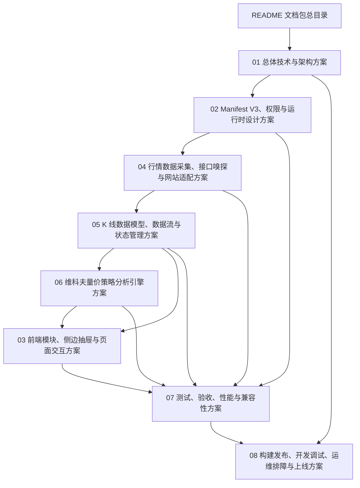

# Chrome K 线分析器插件技术方案文档包

## 1. 文档包说明

本目录是 Chrome 浏览器环境下纯前端 K 线分析器插件的 Markdown 技术方案文档包。

这些文档用于后续真实编码、技术评审、测试验收和上线交付。后续写代码时，请优先读取本目录下的 `.md` 文件；只有需要生成评审归档材料时，才考虑再生成 `.docx`。

## 2. 文档清单

| 序号 | 文档 | 用途 | 编码优先级 |
|---:|---|---|---|
| 1 | [01_Chrome_K线分析器插件总体技术与架构方案.md](./01_Chrome_K线分析器插件总体技术与架构方案.md) | 项目目标、范围边界、总体架构、技术选型、风险、排期 | 高 |
| 2 | [02_Chrome_Extension_Manifest_V3_权限与运行时设计方案.md](./02_Chrome_Extension_Manifest_V3_权限与运行时设计方案.md) | Manifest V3、权限、运行上下文、消息协议 | 高 |
| 3 | [03_前端模块_侧边抽屉与页面交互设计方案.md](./03_前端模块_侧边抽屉与页面交互设计方案.md) | 侧边抽屉、框选交互、结果展示、配置和历史 | 高 |
| 4 | [04_行情数据采集_接口嗅探与网站适配设计方案.md](./04_行情数据采集_接口嗅探与网站适配设计方案.md) | Fetch/XHR Hook、webRequest、DOM 降级、网站适配器 | 高 |
| 5 | [05_K线数据模型_数据流与状态管理方案.md](./05_K线数据模型_数据流与状态管理方案.md) | OHLCV、状态管理、缓存、历史记录、配置模型 | 高 |
| 6 | [06_维科夫量价策略分析引擎设计方案.md](./06_维科夫量价策略分析引擎设计方案.md) | 成交量分析、维科夫阶段、买卖点规则、置信度评分 | 高 |
| 7 | [07_测试验收_性能与兼容性方案.md](./07_测试验收_性能与兼容性方案.md) | 单测、集成、E2E、性能、安全和验收标准 | 中 |
| 8 | [08_构建发布_开发调试_运维排障与上线方案.md](./08_构建发布_开发调试_运维排障与上线方案.md) | 工程结构、开发调试、构建发布、回滚、排障 | 中 |

## 3. 推荐阅读顺序

建议按以下顺序阅读：

1. 先读 `01_Chrome_K线分析器插件总体技术与架构方案.md`，确认项目范围、技术栈、架构边界和落地计划。
2. 再读 `02_Chrome_Extension_Manifest_V3_权限与运行时设计方案.md`，确认插件权限、运行上下文和消息通信方式。
3. 实现数据采集前读 `04_行情数据采集_接口嗅探与网站适配设计方案.md`。
4. 定义类型、Store、缓存前读 `05_K线数据模型_数据流与状态管理方案.md`。
5. 实现策略前读 `06_维科夫量价策略分析引擎设计方案.md`。
6. 实现界面前读 `03_前端模块_侧边抽屉与页面交互设计方案.md`。
7. 写测试和验收前读 `07_测试验收_性能与兼容性方案.md`。
8. 补齐工程脚本、调试流程、发布和排障前读 `08_构建发布_开发调试_运维排障与上线方案.md`。

## 4. 后续代码实现优先读取

| 开发任务 | 优先读取文档 |
|---|---|
| 初始化 Chrome 插件工程 | 01、02、08 |
| 编写 `manifest.json` | 02 |
| 实现 Background Service Worker | 02、05 |
| 实现 Content Script | 02、03、04 |
| 实现 Inject Script 和接口 Hook | 02、04 |
| 实现网站适配器 | 04、05 |
| 定义 TypeScript 数据模型 | 05、06 |
| 实现维科夫策略引擎 | 06 |
| 实现侧边抽屉 UI | 03、05、06 |
| 实现本地存储和历史记录 | 05、08 |
| 编写测试 | 07 |
| 打包、发布、回滚 | 08 |

## 5. 原 24 章覆盖映射

| 原章节 | 映射文档 |
|---|---|
| 1 文档说明 | README、01 |
| 2 需求分析 | 01 |
| 3 总体技术方案 | 01 |
| 4 技术选型 | 01、02、05、07 |
| 5 系统架构设计 | 01、02 |
| 6 模块拆分设计 | 01、03 |
| 7.1 K 线区域框选设计 | 03 |
| 7.2 行情接口爬取与识别设计 | 04 |
| 7.3 K 线数据解析设计 | 04、05 |
| 7.4 成交量分析设计 | 06 |
| 7.5 维科夫量价策略设计 | 06 |
| 7.6 分析结果生成设计 | 03、06 |
| 7.7 侧边抽屉面板设计 | 03 |
| 7.8 多网站适配设计 | 04 |
| 8 数据流设计 | 05 |
| 9 数据结构设计 | 05、06 |
| 10 部署结构设计 | 01、08 |
| 11 安全设计 | 01、02 |
| 12 性能设计 | 07 |
| 13 兼容性设计 | 03、04、07 |
| 14 可观测性与调试设计 | 08 |
| 15 开发指南 | 08 |
| 16 测试方案 | 07 |
| 17 上手使用指南 | 03、08 |
| 18 上线方案 | 01、07、08 |
| 19 风险清单 | 01、04、06、07 |
| 20 应急预案 | 08 |
| 21 落地排期 | 01、08 |
| 22 成本评估 | 01、08 |
| 23 运营与维护方案 | 08 |
| 24 附录 | 02、05、06、08、README |

## 6. 文档使用约定

1. 后续编码以 Markdown 文档为主输入，不以 Word 文档为主输入。
2. 涉及接口、事件、消息通信、权限、存储、安全策略时，优先查阅对应专项文档。
3. 若文档内容与实际代码冲突，以最新代码为准，并同步回写更新 Markdown。
4. 策略相关实现必须保留原因码、置信度和风险提示，不能只输出买入或卖出结论。
5. 插件输出内容仅作为技术分析辅助信息，不构成投资建议。

## 7. 统一声明

本插件输出的买点、卖点、观望信号属于技术分析辅助信息，不构成投资建议。插件不保证分析结果准确性，不承诺收益，不替代用户独立判断。